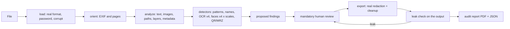

# Plan: local anonymizer for documents and images (CoP 33 / SmartGORE)

Status: **phase 0 finished, awaiting review.** This document summarizes what was built in
phase 0, proposes the plan for phases 1 to 3 and spells out the decisions I need you to make
before phase 1 starts (section 12). None of what follows is implemented in the engine yet:
phase 0 only built the test set and the metric.

---

## 1. Summary

**What was done in phase 0**

- The whole notebook (the CoP 33 notebook this project starts from) was read and its logic
  was run against a new test set, to measure what it covers and what it does not (section 2).
- A reproducible **test bench** was built (`test_bench/`, `scripts/generate_test_data.py`):
  102 fictitious files in 10 categories, with 971 precisely located personal-data items
  (polygons verified against the ink), 1 900 neutral reference texts, 44 hidden sensitive
  metadata items and 7 files that must be rejected. Separately, 28 real public documents of up
  to 5 pages (local only, with no ground truth) for experiments.
- On request, an **engine prototype** was also built (section 11.3), which already meets the
  acceptance criterion on the test set. It is a preview to look at results, not the phase 1
  engine.
- The **metric** was defined (`docs/metrics.md`): recall by type, and leaks checked in the
  output file through six independent routes. The evaluator validates itself with three
  baselines (identity, oracle and notebook).
- With primary evidence and independent adversarial verification, the following were
  verified: the licenses of every planned dependency, the face sources, the actual behavior of
  PyMuPDF and pdfium, and the Chilean formats of RUT (Rol Único Tributario, the national
  tax/ID number), phone, email and cédula (the national ID card).

**The most important things I found**

0. **The PDF the notebook produces keeps the full original text.** `doc.save(salida)` leaves
   the pre-redaction content stream inside the file as an orphan object: name, RUT, email,
   phone, address and URL are still there, readable with any PDF tool, even though the page no
   longer shows them and the notebook's check says "eliminados" (removed). The same happens
   with redacted images. It reproduces with the notebook's code unchanged:
   `uv run python scripts/demo_notebook_leak.py`. In 28 real public documents, 39 of the 60
   data items the notebook "redacted" were still recoverable. If anyone has used the draft,
   the fix is to save with `doc.save(salida, garbage=4, deflate=True, clean=True)`.
1. **PyMuPDF is licensed AGPL-3.0** (or under an Artifex commercial license). That clashes
   with your permissive-license policy and with the technical decision to use
   `apply_redactions`. There is a permissive path already proven in a prototype (pdfium). A
   decision is needed (D1).
2. **The notebook's phone pattern fully detects only 14 of 52 real ways of writing a Chilean
   number**: no regional landline (`(41) 221 3456`), no `22 123 4567`, no
   `+56-9-8123-4567`. For regional governments (GOREs, Gobiernos Regionales) it is the most
   serious gap.
3. **YuNet only detects faces well at roughly 10 to 300 pixels**: it fails on large portraits
   at full resolution and on small faces if the image is downscaled. Detection has to run at
   several scales. It also misses 2 of 3 pure profiles.
4. **OpenCV from PyPI on macOS ships GPL-3.0 FFmpeg**, linked in a way that cannot be removed.
   On Windows it can be removed. This affects the viability of macOS (D4: version 1 is Windows
   only).
5. **RapidOCR pulls in copyleft dependencies and code that uses the network** (model downloads,
   reading URLs). I propose using its models and porting only the inference (section 5.4).
6. **The Chilean cédula encodes the RUN (Rol Único Nacional, the personal ID number), the
   document number and the date of birth in its QR code and in the MRZ on the back**, which no
   text pattern detects. I propose QR and MRZ detectors (D7).

---

## 2. What we inherit from the notebook and what has to be fixed

We keep the notebook's whole philosophy: deterministic patterns, **recall over precision**
(the check digit only orders the review), checking up front that the PDF has text, real
redaction (deleting content, not covering it), verification by extracting the output's text,
a final sweep with the same patterns, a name list, and human review as a mandatory step.

These weaknesses were confirmed by running the notebook's code (the `notebook` baseline):

| Topic | What happens today | Evidence | Fix in phase 1 |
|---|---|---|---|
| Phones | 14 of 52 real formats fully matched; 0 regional landlines; false positives such as `Folio 2912345678` | test of 52 variants | broad digit candidates, normalization (+56, 0056, trunk 0) and classification by length; `anexo NNN` (extension) included |
| RUT | does not recognize the en dash (`12.345.678–5`), no hyphen, 9-digit bodies (`100.000.019-8`, MINEDUC) or body and check digit (DV) in separate columns | same | extended pattern; without a hyphen or with an invalid DV only near a label (RUT/RUN/C.I.) or in a table; OCR variants |
| Email | 16 of 31 variants; `[arroba]`, `(at)`, spaces around `@`, PDF line breaks and `©` read by OCR slip through | test of 31 variants | NFKC normalization, joining line breaks, a pass for obfuscations and OCR confusions |
| **Redacted text** | **a plain `doc.save()` leaves the original content stream inside the PDF, with all the text before redaction**, as an orphan object. The notebook's check only looks at the page text and does not see it | `scripts/demo_notebook_leak.py` with the notebook's code unchanged; on the test set, 141 of the 205 data items the notebook did find and cover are still in the file bytes | save with `garbage=4, deflate=True, clean=True` (or a new document) and verify the output bytes, not just the visible text |
| Redacted images | same as text: **the original unredacted image stays inside the PDF** | experiment: after redacting part of an image, the original JPEG was still in the file; with `garbage=4` it goes away | full rewrite of the file and a check that no original image survives |
| Searching for what was detected | `search_for(valor)` searches for the text again: if the finding crosses a line break (the RUT pattern allows `\s` around the hyphen) the area is not found, and the literal search for a name from the list fails if the PDF uses special spaces or hyphens (U+00A0, U+00AD). In both cases **the data item stays unredacted with no warning** | code review and research | use the boxes of each character of the finding itself, never search for the text again |
| Text off the page | `get_text()` clips to the visible page: text outside the box is not detected, but it is still in the file | experiment | extract without clipping and also redact off the page |
| Hidden layers | text in a turned-off optional layer does not appear in `get_text()` | experiment | reveal layers before detecting; remove layers and their names |
| Forms | the value of a form field survives redaction | experiment | flatten forms and annotations before redacting |
| Metadata | after redaction, the author is still in the metadata; XMP, annotations, attachments, JavaScript and bookmarks are not touched | experiment | full structural cleanup (section 6) |
| Saving | a plain `save()` keeps orphan objects (like the image in the row above) | experiment | full rewrite (`garbage=4`, `clean`) or a new document |
| Scans, images, faces | not processed (the notebook says so) | — | OCR, faces and pixel redaction |
| Verification | compares exact strings | code review | go over the output with the same detectors plus structural checks (section 7) |

**Figures for the `notebook` baseline** on the test set: overall recall 22.9 % (62.8 % on text
PDFs; 0 % on scans, images, ID cards and screenshots, which it does not process), 150 critical
leaks and 17 of 44 metadata items leaked. Full report in
`results/details/notebook/evaluation.md` (regenerated with the commands in section 11).

---

## 3. Architecture

```
anonymizer/
  engine/                # pure, typed library, no UI
    model.py             # Finding, Document, Page, Polygon, ReviewStatus, Decision
    loader.py            # format detection by content (not by extension) and understandable errors
    orientation.py       # EXIF, 0/90/180/270 rotations, coordinate transforms
    detectors/
      patterns.py        # RUT, email, phone, URL + OCR variants; check digit only for ordering
      names.py           # list of names and addresses with fuzzy matching (rapidfuzz)
      faces.py           # YuNet at several scales and orientations, box merging and expansion
      ocr.py             # PP-OCR detector, orientation and recognizer on onnxruntime
      codes.py           # QR and MRZ (proposed, D7)
    pdf/
      analysis.py        # page inventory: text, images, paths, layers, annotations, forms
      redaction.py       # real content removal (engine per D1)
      cleanup.py         # metadata, XMP, annotations, attachments, JavaScript, layers, bookmarks
    image/
      redaction.py       # polygon fill; pixel rewrite without metadata
    verification.py      # goes over the output with every detector and structural check
    report.py            # audit report (JSON and PDF)
    pipeline.py          # orchestration: analyze() -> findings; export(decisions) -> output + verification
    config.py            # thresholds, model paths, name list
    log.py               # technical log to a local file
  cli.py                 # anonymizer process input/ output/
  api/                   # FastAPI on 127.0.0.1, random port, uses engine/
  ui/                    # static frontend
  app.py                 # native window with pywebview
test_bench/              # development tool: generator, evaluator, baselines (not shipped)
tests/
test_data/               # generated by script (not versioned)
models/                  # ONNX (not versioned), with a download script and SHA-256 verification
```

**The finding** is the central object, the same in the engine, CLI, API, UI and report:

| Field | Content |
|---|---|
| `id` | stable identifier |
| `file`, `page` | where it is |
| `type` | `rut`, `email`, `phone`, `url`, `name`, `address`, `face`, `ocr_text`, `qr`, `mrz`, `manual` |
| `polygon` | list of points in page coordinates (unrotated PDF points, or pixels of the already-oriented image) |
| `text` | detected text, if applicable |
| `detector` | `regex`, `name_list`, `yunet`, `ocr`, `qr`, `reviewer`… |
| `score` | detector confidence (never decides whether something is redacted) |
| `doubtful`, `reason` | for ordering the review: invalid DV, low-confidence OCR, small face, profile, detected in a single orientation |
| `status` | `proposed` → `confirmed` / `removed` (with an optional reason) / `added` by the reviewer |
| `history` | changes with date and reason |



The engine processes page by page and exposes progress and cancellation, so the UI never
freezes and memory stays bounded (an A4 page at 300 dpi takes about 26 MB).

---

## 4. How each file type is processed

**Real format.** The type is decided by the first bytes, not by the extension. A password, an
empty, corrupt or unsupported file produce a clear message ("Este archivo está protegido con
contraseña", "This file is password-protected") and are listed in the report. A PDF with only a
permissions password is opened and processed (those restrictions protect nothing), and the
report mentions it.

**PDF with a text layer.**
1. Page inventory: text (without clipping to the page), optional layers (revealed),
   annotations and forms (flattened), images (with their location), vector paths.
2. Up-front warning about **fake redactions**: dark rectangles over text that is still
   extractable, and redaction annotations that were never applied. This is the classic
   transparency mistake; they are shown to the reviewer and the text underneath is detected
   like any other.
3. Patterns and names on the normalized text, with the geometry of each character.
4. Every embedded image: OCR and faces; the areas are mapped to page coordinates.
5. Pages with text converted to paths (no extractable text but with ink): they are rendered
   and OCR is applied. When to do it is a trade-off between time and recall (D8).
6. Export: real removal of the content under each area (text, image pixels, paths),
   structural cleanup and a full rewrite of the file.

**Scanned PDF (no text layer) or mixed page.** The page is rendered at 300 dpi (200 dpi if the
page is very large), OCR and faces run with rotations, and the page is rebuilt as a redacted
image, without adding any text layer (D9). If it carries an invisible OCR text layer (a scanner's
"sandwich" PDF), that layer also contains the data: the redacted spans are removed from it along
with the pixels, and the rest of the layer stays as the original had it.

**Image (JPG, PNG, WEBP, multi-page TIFF).** The EXIF orientation is applied and detection runs
with rotations. The output is written from the pixels, in the same format and **with no
metadata at all**: no EXIF or GPS, nor the EXIF thumbnail (which keeps the original unredacted
image), XMP, IPTC or PNG text chunks. TIFF pages are processed one by one.

**HEIC.** Not supported in version 1 (D5): the only non-GPL reading library (pi-heif) is
LGPL-3.0, and phones and Windows convert HEIC photos to JPG. The app recognizes them (by
extension and by content) and asks for a JPG instead of calling them an unknown format.

---

## 5. Detectors

### 5.1 Patterns (RUT, email, phone, URL)

Base: the notebook's `PATRONES` (patterns), plus what the research showed is missing:

- **RUT**: a body of 1 to 9 digits with `.`, space, `,` or `·` separators; any hyphen
  (`-`, `–`, `—`, `‑`) or none; the labels RUT, RUN, R.U.T., C.I., "Cédula de identidad"
  case-insensitively. Without a hyphen or with an invalid DV, only next to a label or in a
  table (about 9 % of mobile numbers pass the DV when read as a RUT). The DV **never
  discards**: a RUT with an invalid DV is redacted and flagged as doubtful.
- **Phone**: every current area code (2, 32–35, 41–45, 51–53, 55, 57, 58, 61, 63–65, 67,
  71–73, 75, plus 44 for VoIP), mobiles, old formats with 0 and 09, old 8-digit numbers only
  next to a label (Fono, Tel., Cel., WhatsApp), extensions. 600/800 numbers are institutional:
  by default they are redacted anyway and the reviewer decides (D10).
- **Email**: NFKC, apostrophes, obfuscations (`[arroba]`, `(at)`, `arroba … punto cl`), PDF
  line breaks and soft hyphens.
- **Tolerance to OCR errors** (only on text that comes from OCR): O/o/D/Q→0, l/I/i/|→1, Z→2,
  S/$→5, B→8, g/q→9, `@` read as `©`/`®`, `.cl` read as `.c1`/`,cl`, extra spaces or periods.
  The literal reading is tried first and then the corrected one. If the corrected one
  validates the DV, confidence goes up; if not, it is redacted anyway.

### 5.2 Names and addresses

A list (one name or one address per line) with fuzzy matching: ignoring accents and case, in
any order ("Rojas Peña, Ana María"), partial (first name and first surname), and tolerant to
OCR errors (bounded edit distance with rapidfuzz). Names that are not on the list **are not
detected**: this is a documented limit, and the test set measures it on purpose.

### 5.3 Faces

- YuNet (`face_detection_yunet_2026may.onnx`, MIT; dynamic input intended for OpenCV 5).
- EXIF orientation first; then 0°, 90°, 180° and 270°. The boxes go back to the original
  coordinates and are merged.
- **Several scales** (a research finding): YuNet works with faces of about 10 to 300 px.
  Detection runs with the long side at 640 and at 1280 px and, for small faces, on tiles at
  full resolution. In the test, a portrait at 2048 px produced wrong boxes and at 640–1280 px
  produced the correct box.
- Low threshold (recall), box merging and a 20 % expansion to cover hair and ears.
- Profiles: YuNet missed 2 of 3 pure profiles and mistook ears for faces. I propose measuring
  a second, permissively licensed detector in phase 1 (OpenCV's profile classifier) and
  flagging as doubtful the images with people but no detected face.
- Intermediate angles: if recall drops at 45° (likely), passes at 45°, 135°, 225° and 315° are
  added. YuNet is fast, so the cost is low; it is decided with the phase 1 numbers.

### 5.4 Text in images (OCR)

- PaddleOCR models in ONNX (Apache-2.0), via RapidOCR: detector, orientation classifier and
  recognizer. The `rapidocr` 3.9.2 package ships PP-OCRv6 *small* (a 9.9 MB detector and a
  21.2 MB recognizer) and the 0.6 MB 0/180 classifier. The recognizer is multilingual and
  includes every accented letter, ñ/Ñ, ü, ¿, º and ª (it lacks only ¡). In a synthetic test it
  read lines with a RUT, an email, a phone and "Peña Muñoz" without errors at 0°, 15° and 180°,
  and failed at 90°: the 4 rotations are needed. In another test, the PP-OCRv5 *mobile*
  detector found 5 of 5 lines and the PP-OCRv6 ones 4 of 5; the choice is made with the test
  set in phase 1. The recognizer also returns per-word quadrilaterals, which makes it possible
  to redact only the RUT and not the whole line.
- **Proposal for a concrete problem:** do not use the `rapidocr` package as-is. It requires
  OpenCV with a GUI (Qt and FFmpeg), shapely (GEOS, LGPL), requests/certifi and tqdm (MPL), and
  it has code that downloads models and opens URLs. Instead, port only the inference
  (preprocessing, detector postprocessing, classifier, recognizer decoding; about 400 lines
  with Apache-2.0 attribution) on top of onnxruntime, numpy, headless OpenCV and pyclipper
  (MIT). That way there is no network code in the application and the polygon output is under
  our control.
- Orientation classifier enabled, plus the 4 rotations of the whole image; the polygonal boxes
  (rotated quadrilaterals) go back to the original coordinates and are merged.
- Redaction uses the detector's **rotated polygon**, not its bounding rectangle.
- A "redact all text in this image" mode, which can be enabled per file.
- Mirrored text (photo taken with a front camera): the 4 rotations do not read it. Adding the
  mirrored version doubles the OCR time (D6).

### 5.5 QR and MRZ (proposed)

The cédula's QR code encodes a URL with the RUN, the document number and the date of birth.
The MRZ on the back (3 lines of 30 characters) contains surnames, given names, RUN and dates
without dots or hyphens. OpenCV decodes QR codes without the network (Apache-2.0), and the MRZ
is recognized by its shape in the OCR text. I propose always redacting the whole block (D7).

---

## 5.6 Nothing leaves the computer

- The application code makes no network calls. RapidOCR has no telemetry, but it does download
  models from ModelScope if a file is missing or its SHA-256 does not match, and it opens images
  from URLs. Once the inference is ported (5.4), that code does not exist.
- **onnxruntime ships telemetry.** On Windows it logs Microsoft ETW events; it is disabled with
  `onnxruntime.disable_telemetry_events()`, and what gets sent depends on the Windows
  diagnostic settings. On macOS, since version 1.29, it uploads events over HTTPS to Microsoft
  and stores a machine identifier unless `ORT_DISABLE_TELEMETRY=1` is set before importing it.
  Both measures go at program startup, with a test.
- **WebView2 (pywebview's window on Windows) connects on its own**: in the test it requested
  Edge's experiment configuration and looked for a proxy (WPAD), while showing only
  `http://127.0.0.1`. With hardened startup arguments those two connections go away, but one
  TLS connection from the WebView2 process to Microsoft servers remained (probably from the
  Windows sign-in), which no argument suppresses. Documents never travel through it, but "zero
  traffic" cannot be claimed for the Windows component (D11).
- Short install paths: with long paths (such as OneDrive's) Windows fails to load native
  libraries.

## 6. Real redaction and cleanup

Regardless of the PDF engine chosen (D1), the contract is the same:

- **PDF**: the content under each area is removed: characters, image pixels (including images
  with transparency, CMYK, 1-bit and inline images) and paths. Forms and annotations are
  flattened. Metadata, XMP, attachments, JavaScript, layers and their names, bookmarks, page
  labels, thumbnails and `ActualText`/`Alt` are removed. The file is fully rewritten, with no
  previous revisions or orphan objects, and without a password.
- **Image**: solid fill of the polygon (faces: solid fill by default; strong pixelation
  optional, with blocks of at least one sixth of the face width). The output image is created
  from the pixels, without metadata.
- What the PyMuPDF research left as rules (they apply if PyMuPDF is used):
  `add_redact_annot` with a rotated quadrilateral redacts its bounding rectangle (several small
  rectangles are used instead); grow each area by 1–2 pt; `scrub()` with its defaults fails on
  annotation replies, deletes the OCR layer of scans and does not erase pixels when applying
  pending redactions, so it is called with explicit parameters and completed by hand; redacted
  images are left uncompressed unless the file is saved with `deflate=True`.

---

## 7. Leak check

After exporting, the engine opens the output and goes over it:

1. The same detectors on the output: patterns and names on the text extracted by **two
   independent engines** (pdfium also extracts hidden and off-page text), OCR and faces on the
   rendered pages.
2. A search for every redacted value in the file bytes, in the decompressed streams and in the
   strings of every object.
3. Structural checks: metadata, annotations, attachments, layers, JavaScript, previous
   revisions, EXIF, thumbnail, XMP and the image's text chunks.
4. Under each redacted area, that no image with the original pixels remains under the fill.

Anything that shows up is a **leak**: it is shown in red in the review, blocks the export of
that file until the reviewer resolves it, and is recorded in the report. The app never says
"documento limpio" ("clean document"); it says "revisión lista para confirmar" ("review ready
to confirm").

---

## 8. Human review and report

Phase 2 in detail, with a mockup first for your approval. In short:

- A review screen with a viewer, areas colored by type and a side list of findings with the
  **doubtful ones first** (invalid DV, low-confidence OCR, small or profile faces, detected in
  a single orientation).
- Add areas by drawing; **removing an area requires confirmation and is logged**, with an
  optional reason.
- Audit report (PDF and JSON): what was redacted, where, by which detector, what the reviewer
  changed and the result of the leak check. The JSON follows the contract used by the test
  bench evaluator, so the app can be evaluated as-is.

### 8.1 Choosing what to search for, and how long it takes

Implemented (2026-10-01). Before processing, the user chooses which groups of detections run
(screen 1, panel "Qué buscar"). One source of truth: `anonymizer/engine/model.py`
(`DETECTION_GROUPS`, with the Spanish label, description and warning, and `DetectionOptions`).

| Group (`key`) | What it covers | Default |
|---|---|---|
| `patterns` | RUT, email and phone | always on (locked) |
| `urls_personal` | personal URLs (D12) | on |
| `urls_other` | not a detection: whether the other URLs start applied (D12) | off |
| `names_list` | names and addresses of the user's list | on |
| `names_context` | names by context: given-name dictionary, signatures, tables, "Nombre:" (D13) | on |
| `ocr` | text in scans, photos and images inside PDFs | on |
| `faces` | faces | on |
| `qr` | QR codes | on |

- `patterns` cannot be turned off: the leak check runs those patterns again over every output
  and D2 requires zero base-level leaks of them (the API answers 400).
- A group that is off **skips its work**, it does not just hide results: with OCR off there is
  no OCR pass, so scanned pages and images get no text-based finding at all (patterns, names
  and URLs in pixels are not read); faces and QR off do not call their detectors; with OCR,
  faces and QR off no page is rendered. `names_list` off: the entries are not searched (context
  names are still found, all of them doubtful). `names_context` off: no given-name dictionary
  and no name or signature context rules; the context rules for RUT, email, phone and address
  stay with the patterns. With every group on and the other URLs applied, the findings are
  exactly the ones of the engine before this change (checked on 16 files of the test set).
- The choice lives only in the session: every start of the app goes back to the defaults
  (recall over precision; nobody finds a group off by surprise). Each file records the groups
  it was processed with; the review screen shows "En este archivo no se buscaron: …" when some
  were off (and says plainly that nothing inside the images was searched when OCR was off), and
  the audit report lists the groups that were on and off.
- The engine measures the real time of each stage (`AnalyzedFile.timings`): `text` (text layer,
  patterns, names, context), `render` (rendering a page or decoding an image for OCR, faces or
  QR), `ocr`, `faces`, `qr` and the total `analyze`. Time spent waiting for a lock held by
  another analysis (OCR, faces, PyMuPDF) is left out of the stage; two analyses still share the
  processor, so a stage can be slower while another file runs, and that is not subtracted.
- **Estimate.** `engine.profile(file)` reads cheap facts without rendering anything (pages,
  scanned pages, the images of text pages and their size, frames and megapixels of an image), and
  `engine/estimate.py` multiplies them by a few seconds-per-unit rates. The defaults were
  measured on the development machine (table below). After every analysis the rates move
  towards the measured times (exponential moving average, weight 0.3, each rate in proportion to
  its share of its stage) and are saved in `%LOCALAPPDATA%/Anonimizador/estimates_<engine>.json`:
  only those numbers, never file names or content. The UI shows the time per group and the total
  for the groups that are on ("Tiempo estimado: ≈ 1 min 20 s · depende del computador"), and each
  finished file shows its measured time per stage.

Default rates (seconds per unit), fitted to the stage times of the 95 readable files of the test
set on the development machine (one analysis at a time, every group on). With them the estimate
of the whole set is 427 s against 486 s measured; per file, the median ratio estimate/measured is
0.98 (10 % of the files below 0.52, 10 % above 2.25: OCR time depends on how much text there is).

| Stage | Unit | Seconds |
|---|---|---|
| text | PDF page | 0.075 |
| render | rendered PDF page (scanned or with images) / megapixel of an image | 0.14 / 0.02 |
| ocr | scanned page | 10 |
| ocr | distinct image on a text page / its megapixels at 200 dpi | 1.45 / 1.9 |
| ocr | frame of an image file (photos about 2 s, screenshots about 10 s) | 3.5 |
| faces | scanned page / image on a text page / megapixel of an image | 1.2 / 0.15 / 0.35 |
| qr | rendered PDF page / megapixel of an image | 0.1 / 0.02 |

---

## 9. Performance and memory

- Measured in phase 1 with the test set, limiting onnxruntime and OpenCV to 4 threads to
  approximate an ordinary PC. The development machine is more powerful (i7-13620H, 16 GB), so
  both figures will be reported.
- Initial targets, to be discussed with the numbers in hand: standalone image ≤ 5 s; scanned
  page ≤ 10 s; text page ≤ 1 s (without page OCR); peak memory < 2 GB.
- The dominant cost will be OCR with 4 rotations (or 8, with mirroring). If time clashes with
  recall, I will present it as a decision with figures, not settle it silently.

---

## 10. Next phases

**Phase 1: engine and CLI.**
1. Data model, loading and understandable errors.
2. New patterns, with unit tests for the 52 phone variants and the RUT and email ones.
3. Names with fuzzy matching.
4. Ported OCR and faces at several scales and orientations.
5. PDF: inventory, real redaction, cleanup (per D1).
6. Images and TIFF.
7. Leak check.
8. JSON report (compatible with the evaluator) and CLI.
9. Measurement of recall, leaks and times with `test_bench.evaluate`.

Acceptance criterion: the one in `docs/metrics.md`, section 5.

**Phase 2: API and UI.** First, a mockup of the review screen for approval. Then the local API
(127.0.0.1, random port, session token), the UI (start, cancellable progress, review,
export), light and dark mode, AA contrast, full keyboard navigation, and everything in Chilean
Spanish.

**Phase 3: packaging.** PyInstaller in folder mode (keeps any accepted LGPL or MPL libraries
replaceable). The `.spec` excludes OpenCV's FFmpeg DLL, reportlab's GPL fonts and everything
development-only, and a test fails if they show up. The bundle must include `LICENSE` at its
root (next to the `anonymizer` package also works): the "Acerca de" dialog shows it
(`anonymizer/about.py`, `GET /api/about`) and only points to the source when it is missing.
Also: `LICENSES.md` generated from the actual license files, a test that there is no network
traffic, the final size, `README.md` with screenshots and `DEVELOPMENT.md`. Windows only (D4:
macOS is not a version-1 target).

---

## 11. Test set and metric (phase 0 deliverables)

### 11.1 Fictitious test set (`test_data/generated/`)

| Category | Files | Personal data | Metadata | What it exercises |
|---|---|---|---|---|
| Text PDF | 12 | 292 | — | every RUT, phone and email format; page with `/Rotate 90`; rotated text; tiny text, white on white, under an image and off the page; text converted to paths; embedded images, QR |
| PDF with metadata | 4 | 28 | 17 | Info, XMP, annotations, attachments, hidden layer, form, bookmarks, JavaScript, incremental revision, fake redaction, PDF with a permissions password |
| Scanned PDF | 8 | 107 | — | 300/200/150 dpi, skewed, upside down, sideways, with a photo, mixed, OCR sandwich, stamp, signature, handwriting |
| Rotated image | 17 | 84 | — | 0/90/180/270/15/45°, mirror, noise, 12 px text, low contrast |
| EXIF | 8 | 33 | 23 | orientations 3/6/8 and wrong EXIF, GPS, thumbnail, XMP, IPTC, PNG and WEBP |
| TIFF | 2 | 22 | 4 | multi-page with pages of different size and rotation, 1-bit |
| Fictitious cédula | 7 | 45 | — | flat, photographed in perspective, rotated 30°, with glare, back with MRZ and QR, PDF with both sides |
| Screenshots | 7 | 192 | — | email, mobile chat, spreadsheet (also downscaled to 8 px), web form, high density |
| Faces | 30 | 168 | — | frontal, three-quarter and profile portraits; rotated; groups from 22 to 190 px; 9 real photos; poster; occlusion; low resolution |
| Errors | 7 | — | — | password, corrupt, empty, fake format, truncated image, .docx |

Faces: Face Research Lab London Set (CC BY 4.0, with consent), Open Images V7 (CC BY 2.0) and
US public-domain portraits. Details and attributions in `LICENSES.md`.

### 11.2 Validating the evaluator

| System | Recall | Critical leaks | Metadata leaked | Errors correctly rejected |
|---|---|---|---|---|
| identity (unchanged copy) | 0 % | 397 (all) | 44 of 44 | 0 of 7 |
| oracle (redacts using the answer) | 100 % | 0 | 0 | 7 of 7 |
| notebook | 22.9 % | 150 | 17 of 44 | 0 of 7 |

Identity flags everything as a leak (the evaluator is not blind to any case) and the oracle
flags nothing (the ground truth and the coordinates are correct).

### 11.3 Engine prototype (preview)

`test_bench/baselines/prototype.py`: extended patterns on the geometry of each character, name
list, OCR (PP-OCRv6) at 0/90/270° plus the 180° classifier, YuNet in 4 orientations and 2
scales, QR, real redaction and full cleanup. Result on the test set:

| Type (base level) | Recall | Leaks |
|---|---|---|
| RUT (112) | 100 % | 0 |
| Email (155) | 100 % | 0 |
| Phone (130) | 100 % | 0 |
| URL (23) | 100 % | 0 |
| Name from the list (160) | 100 % | 0 |
| Address from the list (35) | 100 % | 0 |
| Face (161) | 96.9 % | 5, all in real crowd photos |

Metadata leaked: 0 of 44. Errors correctly rejected: 7 of 7. **Verdict on the phase 1
criterion: PASSED.** Under stress: RUT 81 %, email 89 %, phone 93 %, faces 100 %. Out of scope,
as expected: names not on the list and signatures.

What is missing for it to be the phase 1 engine: redacting only the data item and not the whole
OCR line (today it covers 13 % of the neutral text), its own leak check, the PDF engine per D1,
times (median 12 s per image and up to 100 s per scanned page on this loaded machine), small
faces in crowds, and everything in section 10.

The bench runs the engine with every detection group on and the URLs that are not personal
applied (`DetectionOptions.everything()`, section 8.1), so its numbers stay comparable with the
runs made before the groups could be chosen and before D12 left those URLs unapplied by default.

**Metric**: see `docs/metrics.md`.

**How to regenerate**:

```
uv sync --group data
uv run python scripts/generate_test_data.py        # test_data/generated/ + manifest.json
uv run python -m test_bench.baseline oracle --manifest test_data/generated/manifest.json --output results/details/oracle
uv run python -m test_bench.evaluate --manifest test_data/generated/manifest.json --redaction-report results/details/oracle/report.json --outputs-dir results/details/oracle/files --report-dir results/details/oracle
uv run python -m test_bench.visualize test_data/generated/manifest.json --output results/details/overlays
uv sync --group prototype --group data   # for the prototype (OCR and faces)
uv run python -m test_bench.baseline prototype --manifest test_data/generated/manifest.json --output results/details/prototype --processes 5
uv run python -m test_bench.compare          # sheets in results/examples
uv run python -m test_bench.process_folder <folder with documents> --output results/gore
```

---

## 12. Decisions I need

**D1. PDF engine: PyMuPDF (AGPL) versus the license policy.** This is the main clash.

| Option | Advantages | Costs and risks |
|---|---|---|
| **A. pdfium (BSD/Apache) + pypdf (BSD) + fallback rasterization** | Respects the policy. A prototype already removed text for real, even part of a line, and rewrote image pixels without leaving a trace in the file. | About 3 to 6 more days of development. Unusual fonts (Type3, no character map) may not be rebuilt: those pages are rasterized automatically. The glyphs of the embedded font stay in the file (it reveals which letters are used, not the text). |
| B. PyMuPDF with an Artifex commercial license | It is the most proven engine (`apply_redactions`); the original technical plan works as-is. | Paid license (per copy or subscription, with a quarterly minimum) and a purchasing process. |
| C. PyMuPDF under AGPL | No cost and no extra work. | The whole application becomes AGPL and every delivery to another agency requires offering the complete source code. It contradicts your policy. |
| D. Always rasterize | The simplest and safest. | The text layer is lost: the PDF is no longer searchable or accessible, and it is larger. |

**My recommendation: A**, with automatic rasterization of the pages the verification cannot
confirm, and full rasterization as a "maximum security" mode. If there is budget and you
prefer the most proven engine, B. PyMuPDF stays only in the test bench (not shipped).

> **Decided (2026-10-01): option C.** The tool is free, for internal use, and its source is
> public on GitHub, so the AGPL is easy to comply with. PyMuPDF stays as the PDF engine and the
> whole project is licensed under **AGPL-3.0-or-later**. When the application is given to
> another institution, it ships with the license text and a notice pointing to the source code
> of that exact version.

**D2. Scope of "zero leaks".** I propose that the phase 1 acceptance criterion apply to the
`base` level in **every** category (text PDF, scans, images rotated at 0/90/180/270/15/45°,
cédula, screenshots, TIFF), and that the `stress` cases (8 px text, mirrored, 150 dpi fax, old
formats, obfuscations) and the `out_of_scope` ones (names not on the list, signatures,
handwriting) be reported without blocking. Do you confirm?

> **Decided (2026-10-01): yes.** Zero leaks at the `base` level in every category.

**D3. Weak-copyleft licenses.** Is any LGPL or MPL component acceptable if its license is
complied with and it stays replaceable (for example certifi, or Eigen inside onnxruntime, which
is header-only MPL)? Is the Intel IPP license (not OSI) that comes inside OpenCV for Windows
acceptable? If the answer is "strictly MIT/Apache/BSD", we build OpenCV without FFmpeg or IPP.

> **Decided (2026-10-05): weak copyleft is acceptable** when its license is complied with and the
> component stays replaceable: its license text ships with the executable, `INDEX.txt` says where
> its source code is, and the one-folder packaging keeps it as separate files that can be swapped
> (`scripts/collect_licenses.py`, `COPYLEFT_SOURCES`). What the Windows build bundles today under
> those terms: GEOS (LGPL-2.1, the DLLs in `Shapely.libs/`, pulled in by rapidocr through shapely),
> certifi and tqdm (MPL-2.0, also through rapidocr) and Eigen inside onnxruntime (MPL-2.0, headers
> compiled in, notice kept). OpenCV's FFmpeg DLL (LGPL) is not bundled: the spec drops it and
> `scripts/build_exe.py` fails the build if it shows up. Porting the OCR inference (5.4) is still
> worth doing to remove rapidocr's network code, but no longer for licensing.
>
> **Intel IPP stays open: it is not weak copyleft, so D3 does not settle it.** The build bundles
> `cv2.pyd` from opencv-python-headless 5.0.0.93, which links Intel IPP ICV 2026.0.0 statically
> (`cv2.getBuildInformation()`: "Intel IPP: 2026.0.0", "3rdparty dependencies: … ipphal ippiw
> ippicv"); its terms (Intel Simplified Software License) ship in OpenCV's
> `LICENSE-3RD-PARTY.txt`. `build_exe.py` cannot drop or check it, since it is inside `cv2.pyd`.
> The fix, once decided, is an OpenCV built with `-DWITH_IPP=OFF`, or YuNet and the OCR
> preprocessing without OpenCV (LICENSES.md, section 1).

**D4. macOS.** With the PyPI wheels it is not viable (GPL FFmpeg inside OpenCV). It is viable
by building OpenCV without FFmpeg, or by running YuNet directly with onnxruntime. It requires a
Mac with macOS 14 or later to build and test. Is it a requirement for version 1?

> **Decided (2026-10-05): no. Version 1 targets Windows only** (Windows 10 and 11, 64-bit, with
> the WebView2 runtime they include). Nothing is built or tested on macOS; the GPL FFmpeg of the
> macOS OpenCV wheels and onnxruntime's HTTPS telemetry there stay documented for a later
> version, which would need an OpenCV without FFmpeg (or YuNet on onnxruntime) and a Mac to test.

**D5. HEIC.** Options: do not support it in version 1 and ask users to convert to JPG (my
recommendation), or use pi-heif (LGPL-3.0, read-only).

> **Decided (2026-10-05): HEIC is not supported in version 1**, and the app says so plainly
> instead of a generic "not a PDF or image" message.
>
> **Implemented (2026-10-05).** HEIC/HEIF photos are recognized by extension (`.heic`, `.heif`,
> `.hif`) and by content (an ISO-BMFF `ftyp` box with a HEIC brand: `common.is_heic`), and get
> the message "Las fotos HEIC (por ejemplo de iPhone) todavía no se pueden abrir. Conviértelas a
> JPG y vuelve a agregarlas.": in the browser upload (`uploadFiles` counts them apart from the
> other skipped files), in `POST /api/files/from-paths` (a chosen HEIC file is skipped with that
> message, also when its extension says otherwise; a chosen folder reports how many HEIC photos
> it had), and in the analysis, as the error code `heic`, if one arrives anyway (a HEIC renamed
> `.jpg` and uploaded). Screen 1 lists it under the accepted formats.

**D6. Mirrored images.** "Volteadas" (flipped) can mean rotated 180° (covered) or mirrored
(photo taken with a front camera). For mirroring, OCR must also run on the mirrored image,
which doubles its time. I propose enabling it only when the normal pass finds no legible text,
or as a per-file option. What does "volteadas" mean to you?

**D7. QR, MRZ and cédulas.** I propose adding QR and MRZ detectors and, when an image looks
like a cédula (an MRZ or labels such as "NÚMERO DOCUMENTO"), suggesting the "redact all text"
mode. Agreed?

**D8. OCR of text pages.** Text converted to paths (common in PDFs exported from design tools)
is only visible with OCR. Options: OCR every text page (more recall, a few seconds per page) or
OCR only pages with suspicious paths (faster). I will decide with figures in phase 1, unless
you prefer to fix it now.

**D9. Output of scans.** I propose rebuilding the page only as an image, without a text layer.
Adding an invisible OCR layer would make the PDF searchable, but it reintroduces text (and OCR
errors) into the published file.

> **Decided (2026-10-05): yes.** Scans are exported as images, without any added text layer.
>
> **Verified (2026-10-05): the export already does this; no code changed.** A scanned page is
> redacted in place (`pdf.redact`: `apply_redactions` with `PDF_REDACT_IMAGE_PIXELS` blacks out
> the pixels under each zone) and the file is rewritten; nothing writes text into it, so the
> page goes out as its image, with no text at all
> (`test_scan_is_exported_as_an_image_without_a_text_layer`). A scan that already carries an
> invisible OCR layer (a scanner's "sandwich" PDF) has more than 50 characters of text, so it is
> treated as a text page: that layer is searched like any text layer and its image is read by OCR.
> On export, the characters under each zone are removed from the layer along with the pixels; the
> rest of the layer is the original's own text, still invisible (render mode 3), not a new OCR
> (`test_sandwich_ocr_layer_keeps_only_the_original_text_that_was_not_redacted`). That leftover
> layer is kept because removing it would also remove the searchability the original had; the
> leak check runs the patterns over it like over any text layer.

**D10. Institutional data.** 600/800 numbers and the RUTs of institutions (for example a GORE's
72.xxx.xxx-x) are not personal data. I propose redacting them anyway by default (recall) and
allowing a configurable allowlist. Amounts and dates are not redacted (as in the notebook), to
be confirmed with the transparency unit.

**D11. WebView2 and network traffic.** The app window uses WebView2, a Windows component that
talks to Microsoft on its own (section 5.6). Options: (a) keep pywebview with the hardened
arguments, SmartScreen and crash reports disabled, and say so clearly in the documentation
(recommended); (b) in addition, ask IT for a machine policy or a firewall rule for the process;
(c) switch to an interface without a web engine, which means Qt (LGPL) or a much poorer
interface. Is (a) acceptable, or is the requirement zero traffic measured with a firewall for
the system components as well?

**D12. URLs.** The notebook's pattern redacted every URL. In a real report that covered 36
links to institutional news (and only halfway, because the URL continued on the next line).
The prototype now redacts only personal URLs: those that contain a data item (RUT, email,
phone, a name from the list), social-network, meeting or shared-file URLs (Teams, Zoom, Drive,
OneDrive…) and those that carry identifiers in the query (`?rut=`, `?id=`, `?token=`). Do we
adopt this as the rule, or do you prefer to redact every URL?

> **Decided (2026-10-01): split URLs into two groups.** Every URL is detected. *Personal* URLs
> (the cases above) are redacted by default. *Other* URLs (institutional links, news) appear in
> the review as their own group, not redacted by default, and the reviewer can redact them one
> by one or all at once.
>
> **Implemented (2026-10-01).** A finding is *optional* only when every datum it covers is a URL
> that is not personal (`text.is_personal_url`: `patterns.PERSONAL_URL`, or a RUT, email, phone
> or listed name inside). A zone that also covers a RUT, email, phone or name is never optional,
> nor is a URL that contains a name or address found elsewhere in the file, whether in the text
> layer or read by OCR (`pdf.data_in_urls`, `real.settle_optional`); copies of an optional URL
> found elsewhere stay optional. Optional findings start in the new status `suggested` (shown,
> not applied): their own group in the review list ("Otros enlaces (sin censurar)"), a dashed
> outline on the page, and "Ver como quedará" does not black them out. The reviewer censors them
> one by one ("Censurar" / "No censurar", logged as `applied` / `skipped`, no reason needed) or
> all at once (`POST /api/files/{id}/findings/apply-optional`); any change reopens a confirmed
> file. On export a suggestion that was not applied stays visible like a censure removed by the
> reviewer (never a leak, and not counted as removed), and the audit report lists the optional
> URLs applied and those left visible. The switch "Censurar también los otros enlaces" (off by
> default, section 8.1) makes them start applied, still optional. The test bench always runs
> with it on.

**D13. Names not on the list.** Your specification says names in free text are only detected
if they are on the list. In the real reports that left signatories, given names next to
surnames from the list, and handwritten attendance lists exposed. The prototype adds context
rules: a full name around a surname from the list, names that start with a known given name in
short lines (signatures, cells, email headers) or after "don/doña/Sr./Sra." (Mr./Mrs.),
label-value pairs (NOMBRE, RUT, Correo, De:, Para:, i.e. name, RUT, email, from, to) and table
columns (Nombre, Correo, Teléfono, Firma, i.e. name, email, phone, signature). In running text
the list still rules. Agreed?

> **Decided (2026-10-01): yes**, detect by context, and mark those names as doubtful so they are
> reviewed first.

---

## 13. Risks

| Risk | Mitigation |
|---|---|
| Unusual PDF fonts break the text rebuild (option A of D1) | verification with two extractors and automatic rasterization of the page |
| Profiles and occluded faces not detected | several scales, a second detector, flagging doubtful ones, human review |
| OCR with small print or low resolution | upscaling before OCR and tiling; documented limit |
| OCR time with 4 or 8 orientations | measure and decide with figures (section 9) |
| Dependencies that bring network code | port the OCR inference, a network-traffic test, onnxruntime without telemetry |
| URL changes in the face sources | catalog with SHA-256 and a local cache |
| The repository lives in OneDrive | `.venv` and generated data get synced; better to move it or exclude folders |

## 14. Limits that will be documented in the app and in the README

- Amounts and dates are not redacted by default (to be confirmed with the transparency unit).
- Names and addresses in running text are only detected if they are on the list; in
  signatures, cells, tables and email headers they are also detected by context (D13).
- OCR can fail with handwriting, very small text or very low-resolution images.
- Profile, very small or occluded faces may not be detected.
- HEIC/HEIF photos (iPhone) are not supported: they must be converted to JPG first (D5).
- Human review of every document before publishing is mandatory.
