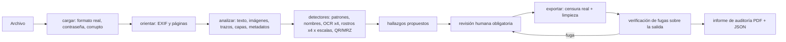

# Plan: anonimizador local de documentos e imágenes (CoP 33 / SmartGORE)

Estado: **fase 0 terminada, esperando revisión.** Este documento resume lo que se construyó en
la fase 0, propone el plan de las fases 1 a 3 y deja explícitas las decisiones que necesito que
tomes antes de empezar la fase 1 (sección 12). Nada de lo que sigue está implementado en el
motor todavía: la fase 0 solo construyó el conjunto de prueba y la métrica.

---

## 1. Resumen

**Lo que se hizo en la fase 0**

- Se leyó el cuaderno completo y se ejecutó su lógica contra un conjunto de prueba nuevo, para
  medir qué cubre y qué no (sección 2).
- Se construyó un **banco de pruebas** reproducible (`banco_pruebas/`, `scripts/generar_datos_prueba.py`):
  102 archivos ficticios en 10 categorías, con 971 datos personales ubicados con exactitud
  (polígonos verificados contra la tinta), 1 900 textos neutros de referencia, 44 metadatos
  sensibles escondidos y 7 archivos que deben rechazarse. Aparte, 28 documentos públicos reales
  de hasta 5 páginas (solo locales, sin verdad de terreno) para experimentos.
- A pedido, se construyó además un **prototipo del motor** (sección 11.3), que ya cumple el
  criterio de aceptación en el conjunto de prueba. Es un adelanto para ver resultados, no el
  motor de la fase 1.
- Se definió la **métrica** (`docs/metricas.md`): recall por tipo y fugas comprobadas en el
  archivo de salida por seis vías independientes. El evaluador se valida a sí mismo con tres
  líneas base (identidad, oráculo y cuaderno).
- Se verificaron, con evidencia primaria y verificación adversarial independiente, las licencias
  de todas las dependencias previstas, las fuentes de rostros, el comportamiento real de
  PyMuPDF y pdfium, y los formatos chilenos de RUT, teléfono, correo y cédula.

**Lo más importante que encontré**

0. **El PDF que entrega el cuaderno conserva el texto original completo.** `doc.save(salida)`
   deja dentro del archivo el flujo de contenido anterior a la censura como objeto huérfano:
   nombre, RUT, correo, teléfono, dirección y URL siguen ahí, legibles con cualquier
   herramienta PDF, aunque la página ya no los muestre y la verificación del cuaderno diga
   "eliminados". Lo mismo pasa con las imágenes censuradas. Se reproduce con el código del
   cuaderno sin cambios: `uv run python scripts/demo_fuga_cuaderno.py`. En 28 documentos
   públicos reales, 39 de los 60 datos que el cuaderno "censuró" seguían recuperables. Si
   alguien llegó a usar el boceto, la corrección es guardar con
   `doc.save(salida, garbage=4, deflate=True, clean=True)`.
1. **PyMuPDF tiene licencia AGPL-3.0** (o comercial de Artifex). Choca con tu política de
   licencias permisivas y con la decisión técnica de usar `apply_redactions`. Existe un camino
   permisivo ya probado en un prototipo (pdfium). Hay que decidir (D1).
2. **El patrón de teléfono del cuaderno detecta completas solo 14 de 52 formas reales de
   escribir un número chileno**: ningún fijo regional (`(41) 221 3456`), ni `22 123 4567`, ni
   `+56-9-8123-4567`. Para gobiernos regionales es el hueco más grave.
3. **YuNet solo detecta bien rostros de unos 10 a 300 píxeles**: falla en retratos grandes
   si se usa a resolución completa y en rostros pequeños si se reduce la imagen. Hay que
   detectar a varias escalas. Además pierde 2 de 3 perfiles puros.
4. **OpenCV de PyPI en macOS trae FFmpeg con licencia GPL-3.0** enlazado de forma que no se
   puede quitar. En Windows se puede quitar. Afecta la viabilidad de macOS (D4).
5. **RapidOCR arrastra dependencias con copyleft y código que usa la red** (descarga de modelos,
   lectura de URLs). Propongo usar sus modelos y portar solo la inferencia (sección 5.4).
6. **La cédula chilena codifica el RUN, el número de documento y la fecha de nacimiento en su
   QR y en la zona MRZ del dorso**, que ningún patrón de texto detecta. Propongo detectores
   de QR y MRZ (D7).

---

## 2. Lo que se hereda del cuaderno y lo que hay que corregir

Se conserva la filosofía completa del cuaderno: patrones deterministas, **recall sobre
precisión** (el dígito verificador solo ordena la revisión), comprobación previa de que el PDF
tiene texto, censura real (eliminar contenido, no tapar), verificación extrayendo el texto de
la salida, barrido final con los mismos patrones, lista de nombres, y la revisión humana como
paso obligatorio.

Estas debilidades se comprobaron ejecutando el código del cuaderno (línea base `cuaderno`):

| Tema | Qué pasa hoy | Evidencia | Corrección en la fase 1 |
|---|---|---|---|
| Teléfonos | 14 de 52 formatos reales completos; 0 fijos regionales; falsos positivos como `Folio 2912345678` | prueba de 52 variantes | candidatos amplios de dígitos, normalización (+56, 0056, 0 troncal) y clasificación por largo; `anexo NNN` incluido |
| RUT | no reconoce guion largo (`12.345.678–5`), sin guion, cuerpos de 9 dígitos (`100.000.019-8`, MINEDUC) ni cuerpo y DV en columnas separadas | idem | patrón ampliado; sin guion o con DV inválido solo cerca de una etiqueta (RUT/RUN/C.I.) o en tabla; variantes de OCR |
| Correo | 16 de 31 variantes; se escapan `[arroba]`, `(at)`, espacios alrededor de `@`, cortes de línea del PDF, `©` leído por OCR | prueba de 31 variantes | normalización NFKC, unión de cortes de línea, pasada de ofuscaciones y confusiones de OCR |
| **Texto censurado** | **el `doc.save()` simple deja dentro del PDF el flujo de contenido original, con todo el texto antes de censurar**, como objeto huérfano. La verificación del cuaderno solo mira el texto de la página y no lo ve | `scripts/demo_fuga_cuaderno.py` con el código del cuaderno sin cambios; en el conjunto de prueba, 141 de los 205 datos que el cuaderno sí encontró y tapó siguen en los bytes del archivo | guardar con `garbage=4, deflate=True, clean=True` (o documento nuevo) y verificar los bytes de la salida, no solo el texto visible |
| Imágenes censuradas | igual que el texto: **queda dentro del PDF la imagen original sin censurar** | experimento: tras censurar parte de una imagen, el JPEG original seguía en el archivo; con `garbage=4` desaparece | reescritura completa del archivo y verificación de que ninguna imagen original sobrevive |
| Búsqueda de lo detectado | `search_for(valor)` vuelve a buscar el texto: si el hallazgo cruza un salto de línea (el patrón de RUT admite `\s` alrededor del guion) la zona no se encuentra, y la búsqueda literal de un nombre de la lista falla si el PDF usa espacios o guiones especiales (U+00A0, U+00AD). En ambos casos **el dato queda sin censurar sin aviso** | revisión del código e investigación | usar las cajas de cada carácter del propio hallazgo, nunca volver a buscar el texto |
| Texto fuera de la página | `get_text()` recorta a la página visible: el texto fuera del recuadro no se detecta, pero sigue en el archivo | experimento | extraer sin recorte y censurar también fuera de la página |
| Capas ocultas | el texto en una capa opcional apagada no aparece en `get_text()` | experimento | revelar capas antes de detectar; eliminar capas y sus nombres |
| Formularios | el valor de un campo de formulario sobrevive a la censura | experimento | aplanar formularios y anotaciones antes de censurar |
| Metadatos | tras censurar, el autor sigue en los metadatos; no se tocan XMP, anotaciones, adjuntos, JavaScript, marcadores | experimento | limpieza estructural completa (sección 6) |
| Guardado | `save()` simple conserva objetos huérfanos (como la imagen de la fila anterior) | experimento | reescritura completa (`garbage=4`, `clean`) o documento nuevo |
| Escaneos, imágenes, rostros | no se procesan (el cuaderno lo avisa) | — | OCR, rostros y censura de píxeles |
| Verificación | compara cadenas exactas | revisión del código | repasar la salida con los mismos detectores más comprobaciones estructurales (sección 7) |

**Cifras de la línea base `cuaderno`** en el conjunto de prueba: recall global 22,9 %
(62,8 % en PDF con texto; 0 % en escaneos, imágenes, cédulas y pantallazos, que no procesa),
150 fugas críticas y 17 de 44 metadatos con fuga. Reporte completo en
`resultados/detalle/cuaderno/evaluacion.md` (se regenera con los comandos de la sección 11).

---

## 3. Arquitectura

```
anonimizador/
  motor/                 # librería pura, tipada, sin UI
    modelo.py            # Hallazgo, Documento, Pagina, Poligono, EstadoRevision, Decision
    cargar.py            # detección de formato por contenido (no por extensión) y errores comprensibles
    orientacion.py       # EXIF, rotaciones 0/90/180/270, transformación de coordenadas
    detectores/
      patrones.py        # RUT, correo, teléfono, URL + variantes de OCR; dígito verificador solo para ordenar
      nombres.py         # lista de nombres y direcciones con coincidencia difusa (rapidfuzz)
      rostros.py         # YuNet a varias escalas y orientaciones, unión y expansión de cajas
      ocr.py             # detector, orientación y reconocedor PP-OCR sobre onnxruntime
      codigos.py         # QR y MRZ (propuesto, D7)
    pdf/
      analisis.py        # inventario de la página: texto, imágenes, trazos, capas, anotaciones, formularios
      censura.py         # eliminación real del contenido (motor según D1)
      limpieza.py        # metadatos, XMP, anotaciones, adjuntos, JavaScript, capas, marcadores
    imagen/
      censura.py         # relleno de polígonos; reescritura de píxeles sin metadatos
    verificacion.py      # repasa la salida con todos los detectores y comprobaciones estructurales
    informe.py           # informe de auditoría (JSON y PDF)
    proceso.py           # orquestación: analizar() -> hallazgos; exportar(decisiones) -> salida + verificación
    config.py            # umbrales, rutas de modelos, lista de nombres
    registro.py          # registro técnico a archivo local
  cli.py                 # anonimizador procesar entrada/ salida/
  api/                   # FastAPI en 127.0.0.1, puerto aleatorio, usa motor/
  ui/                    # frontend estático
  app.py                 # ventana nativa con pywebview
banco_pruebas/           # herramienta de desarrollo: generador, evaluador, líneas base (no se distribuye)
tests/
datos_prueba/            # generado por script (no se versiona)
modelos/                 # ONNX (no se versionan), con script de descarga y verificación SHA-256
```

**El hallazgo** es el objeto central, el mismo en motor, CLI, API, UI e informe:

| Campo | Contenido |
|---|---|
| `id` | identificador estable |
| `archivo`, `pagina` | dónde está |
| `tipo` | `rut`, `correo`, `telefono`, `url`, `nombre`, `direccion`, `rostro`, `texto_ocr`, `qr`, `mrz`, `manual` |
| `poligono` | lista de puntos en coordenadas de la página (puntos PDF sin rotar, o píxeles de la imagen ya orientada) |
| `texto` | texto detectado, si aplica |
| `detector` | `regex`, `lista_nombres`, `yunet`, `ocr`, `qr`, `revisor`… |
| `score` | confianza del detector (nunca decide si se censura) |
| `dudoso`, `motivo` | para ordenar la revisión: DV inválido, OCR de baja confianza, rostro pequeño, perfil, detectado en una sola orientación |
| `estado` | `propuesto` → `confirmado` / `quitado` (con motivo opcional) / `agregado` por el revisor |
| `historial` | cambios con fecha y motivo |



El motor procesa página por página y expone progreso y cancelación, de modo que la UI nunca se
congela y la memoria queda acotada (una página A4 a 300 ppp ocupa unos 26 MB).

---

## 4. Cómo se procesa cada tipo de archivo

**Formato real.** El tipo se decide por los bytes iniciales, no por la extensión. Contraseña,
archivo vacío, corrupto o formato no soportado producen un mensaje claro ("Este archivo está
protegido con contraseña") y quedan en el informe. Un PDF con contraseña solo de permisos se
abre y se procesa (esas restricciones no protegen nada), y el informe lo menciona.

**PDF con capa de texto.**
1. Inventario de la página: texto (sin recortar a la página), capas opcionales (se revelan),
   anotaciones y formularios (se aplanan), imágenes (con su ubicación), trazos vectoriales.
2. Aviso previo de **censuras falsas**: rectángulos oscuros sobre texto que sigue siendo
   extraíble y anotaciones de censura sin aplicar. Es el error clásico de transparencia; se
   muestran al revisor y el texto de abajo se detecta como cualquier otro.
3. Patrones y nombres sobre el texto normalizado, con la geometría de cada carácter.
4. Cada imagen incrustada: OCR y rostros; las zonas se llevan a coordenadas de página.
5. Páginas con texto convertido en trazos (sin texto extraíble pero con tinta): se dibujan y se
   les aplica OCR. Cuándo hacerlo es un compromiso entre tiempo y recall (D8).
6. Exportación: eliminación real del contenido bajo cada zona (texto, píxeles de imágenes,
   trazos), limpieza estructural y reescritura completa del archivo.

**PDF escaneado (sin capa de texto) o página mixta.** Se dibuja la página a 300 ppp (200 ppp si
la página es muy grande), OCR y rostros con rotaciones, y la página se reconstruye como imagen
censurada. Si trae una capa de texto invisible de OCR (PDF "sándwich" de escáner), esa capa
también contiene los datos y se elimina junto con los píxeles.

**Imagen (JPG, PNG, WEBP, TIFF multipágina).** Se aplica la orientación EXIF y se detecta con
rotaciones. La salida se escribe desde los píxeles, con el mismo formato y **sin ningún
metadato**: ni EXIF ni GPS, tampoco la miniatura EXIF (que conserva la imagen original sin
censurar), XMP, IPTC ni bloques de texto PNG. Las páginas TIFF se procesan una a una.

**HEIC.** No es viable sin copyleft: la única biblioteca de lectura sin GPL (pi-heif) es LGPL-3.0
(D5).

---

## 5. Detectores

### 5.1 Patrones (RUT, correo, teléfono, URL)

Base: los `PATRONES` del cuaderno, más lo que la investigación mostró que falta:

- **RUT**: cuerpo de 1 a 9 dígitos con separadores `.`, espacio, `,` o `·`; cualquier guion
  (`-`, `–`, `—`, `‑`) o ninguno; etiquetas RUT, RUN, R.U.T., C.I., "Cédula de identidad" sin
  distinguir mayúsculas. Sin guion o con DV inválido solo junto a una etiqueta o en una tabla
  (un 9 % de los celulares pasan el DV leídos como RUT). El DV **nunca descarta**: un RUT con DV
  inválido se censura y se marca como dudoso.
- **Teléfono**: todas las áreas actuales (2, 32–35, 41–45, 51–53, 55, 57, 58, 61, 63–65, 67,
  71–73, 75, más 44 de VoIP), móviles, formatos antiguos con 0 y 09, números de 8 dígitos
  antiguos solo junto a una etiqueta (Fono, Tel., Cel., WhatsApp), anexos. Los 600/800 son
  institucionales: por defecto se censuran igual y el revisor decide (D10).
- **Correo**: NFKC, apóstrofos, ofuscaciones (`[arroba]`, `(at)`, `arroba … punto cl`), cortes
  de línea y guiones blandos del PDF.
- **Tolerancia a errores de OCR** (solo sobre texto que viene del OCR): O/o/D/Q→0, l/I/i/|→1,
  Z→2, S/$→5, B→8, g/q→9, `@` leído como `©`/`®`, `.cl` leído como `.c1`/`,cl`, espacios o
  puntos de más. Se prueba primero la lectura literal y luego la corregida. Si la corregida
  valida el DV, sube la confianza; si no, igual se censura.

### 5.2 Nombres y direcciones

Lista (un nombre o una dirección por línea) con coincidencia difusa: sin distinguir tildes ni
mayúsculas, en cualquier orden ("Rojas Peña, Ana María"), parcial (nombre y primer apellido),
y tolerante a errores de OCR (distancia de edición acotada con rapidfuzz). Los nombres que no
están en la lista **no se detectan**: es un límite documentado, y el conjunto de prueba lo mide
a propósito.

### 5.3 Rostros

- YuNet (`face_detection_yunet_2026may.onnx`, MIT; entrada dinámica pensada para OpenCV 5).
- Orientación EXIF primero; luego 0°, 90°, 180° y 270°. Las cajas vuelven a coordenadas
  originales y se unen.
- **Varias escalas** (hallazgo de la investigación): YuNet funciona con caras de unos 10 a
  300 px. Se detecta con el lado mayor a 640 y a 1280 px y, para caras pequeñas, en mosaicos a
  resolución completa. En la prueba, un retrato a 2048 px dio cajas erróneas y a 640–1280 px
  dio la caja correcta.
- Umbral bajo (recall), unión de cajas y expansión del 20 % para cubrir pelo y orejas.
- Perfiles: YuNet perdió 2 de 3 perfiles puros y confundió orejas con caras. Propongo medir en
  la fase 1 un segundo detector con licencia permisiva (clasificador de perfiles de OpenCV) y
  marcar como dudosas las imágenes con personas pero sin rostro detectado.
- Ángulos intermedios: si a 45° el recall cae (probable), se agregan pasadas a 45°, 135°, 225°
  y 315°. YuNet es rápido, así que el costo es bajo; se decide con los números de la fase 1.

### 5.4 Texto en imágenes (OCR)

- Modelos PaddleOCR en ONNX (Apache-2.0), vía RapidOCR: detector, clasificador de orientación
  y reconocedor. El paquete `rapidocr` 3.9.2 trae PP-OCRv6 *small* (detector de 9,9 MB y
  reconocedor de 21,2 MB) y el clasificador 0/180 de 0,6 MB. El reconocedor es multilingüe e
  incluye todas las tildes, ñ/Ñ, ü, ¿, º y ª (le falta solo ¡). En una prueba sintética leyó
  sin errores líneas con RUT, correo, teléfono y "Peña Muñoz" a 0°, 15° y 180°, y falló a
  90°: las 4 rotaciones son necesarias. En otra prueba, el detector PP-OCRv5 *mobile* encontró
  5 de 5 líneas y los PP-OCRv6 4 de 5; se elige con el conjunto de prueba en la fase 1. El
  reconocedor entrega también cuadriláteros por palabra, lo que permite censurar solo el RUT
  y no la línea completa.
- **Propuesta ante un problema concreto:** no usar el paquete `rapidocr` tal cual. Exige
  OpenCV con interfaz gráfica (Qt y FFmpeg), shapely (GEOS, LGPL), requests/certifi y tqdm
  (MPL), y tiene código que descarga modelos y abre URLs. En su lugar, portar solo la
  inferencia (preproceso, posproceso del detector, clasificador, decodificación del
  reconocedor; unas 400 líneas con atribución Apache-2.0) sobre onnxruntime, numpy, OpenCV sin
  interfaz y pyclipper (MIT). Así no queda código de red en la aplicación y se controla la
  salida poligonal.
- Clasificador de orientación activado, más las 4 rotaciones de la imagen completa; las cajas
  poligonales (cuadriláteros rotados) vuelven a coordenadas originales y se unen.
- Se censura con el **polígono rotado** del detector, no con su rectángulo envolvente.
- Modo "censurar todo el texto de esta imagen", activable por archivo.
- Texto espejado (foto con cámara frontal): las 4 rotaciones no lo leen. Agregar la versión
  espejada duplica el tiempo de OCR (D6).

### 5.5 QR y MRZ (propuesto)

El QR de la cédula codifica una URL con el RUN, el número de documento y la fecha de
nacimiento. La MRZ del dorso (3 líneas de 30 caracteres) contiene apellidos, nombres, RUN y
fechas sin puntos ni guion. OpenCV decodifica QR sin red (Apache-2.0), y la MRZ se reconoce
por su forma en el texto del OCR. Propongo censurar siempre el bloque completo (D7).

---

## 5.6 Nada sale del computador

- El código de la aplicación no hace llamadas de red. RapidOCR no tiene telemetría, pero sí
  descarga modelos de ModelScope si falta un archivo o su SHA-256 no coincide, y abre imágenes
  desde URL. Al portar la inferencia (5.4), ese código no existe.
- **onnxruntime trae telemetría.** En Windows registra eventos ETW de Microsoft; se desactiva
  con `onnxruntime.disable_telemetry_events()` y lo que se envíe depende de la configuración
  de diagnóstico de Windows. En macOS, desde la versión 1.29, sube eventos por HTTPS a
  Microsoft y guarda un identificador del equipo, salvo que se defina `ORT_DISABLE_TELEMETRY=1`
  antes de importarlo. Ambas medidas van al inicio del programa, con una prueba.
- **WebView2 (la ventana de pywebview en Windows) se conecta por su cuenta**: en la prueba pidió
  la configuración de experimentos de Edge y buscó un proxy (WPAD), mientras mostraba solo
  `http://127.0.0.1`. Con argumentos de arranque endurecidos esas dos conexiones desaparecen,
  pero quedó una conexión TLS del proceso WebView2 a servidores de Microsoft (probablemente del
  inicio de sesión de Windows), que ningún argumento suprime. Los documentos nunca viajan por
  ahí, pero no se puede afirmar "cero tráfico" del componente de Windows (D11).
- Rutas cortas de instalación: en rutas largas (como la de OneDrive) Windows falla al cargar
  bibliotecas nativas.

## 6. Censura real y limpieza

Independiente del motor PDF que se elija (D1), el contrato es el mismo:

- **PDF**: se elimina el contenido bajo cada zona: caracteres, píxeles de las imágenes
  (incluidas las que tienen transparencia, CMYK, 1 bit e imágenes en línea) y trazos. Se aplanan
  formularios y anotaciones. Se eliminan metadatos, XMP, adjuntos, JavaScript, capas y sus
  nombres, marcadores, etiquetas de página, miniaturas, `ActualText`/`Alt`. El archivo se
  reescribe completo, sin revisiones anteriores ni objetos huérfanos, y sin contraseña.
- **Imagen**: relleno sólido del polígono (rostros: relleno sólido por defecto; pixelado fuerte
  opcional, con bloques de al menos un sexto del ancho de la cara). La imagen de salida se crea
  desde los píxeles, sin metadatos.
- Lo que la investigación de PyMuPDF dejó como reglas (aplican si se usa PyMuPDF):
  `add_redact_annot` con un cuadrilátero rotado censura su rectángulo envolvente (se usan
  varios rectángulos pequeños); ampliar cada zona 1–2 pt; `scrub()` por defecto falla con
  respuestas a anotaciones, borra la capa de OCR de los escaneos y no borra píxeles al aplicar
  censuras pendientes, así que se llama con parámetros explícitos y se completa a mano; las
  imágenes censuradas quedan sin comprimir salvo que se guarde con `deflate=True`.

---

## 7. Verificación de fugas

Después de exportar, el motor abre la salida y la repasa:

1. Los mismos detectores sobre la salida: patrones y nombres sobre el texto extraído por
   **dos motores independientes** (pdfium extrae también el texto oculto y fuera de página),
   OCR y rostros sobre las páginas dibujadas.
2. Búsqueda de cada valor censurado en los bytes del archivo, en los flujos descomprimidos y en
   las cadenas de todos los objetos.
3. Comprobaciones estructurales: metadatos, anotaciones, adjuntos, capas, JavaScript,
   revisiones anteriores, EXIF, miniatura, XMP y bloques de texto de la imagen.
4. Bajo cada zona censurada, que no quede una imagen con los píxeles originales debajo del
   relleno.

Todo lo que aparezca es una **fuga**: se muestra en rojo en la revisión, bloquea la exportación
de ese archivo hasta que el revisor la resuelva y queda en el informe. La app nunca dice
"documento limpio"; dice "revisión lista para confirmar".

---

## 8. Revisión humana e informe

Fase 2 en detalle, con mockup previo para tu aprobación. En resumen:

- Pantalla de revisión con visor, zonas coloreadas por tipo y lista lateral de hallazgos con
  los **dudosos primero** (DV inválido, OCR de baja confianza, rostros pequeños o de perfil,
  detectados en una sola orientación).
- Agregar zonas dibujando; **quitar una zona exige confirmación y queda registrado** con motivo
  opcional.
- Informe de auditoría (PDF y JSON): qué se censuró, dónde, con qué detector, qué cambió el
  revisor y el resultado de la verificación de fugas. El JSON sigue el contrato que usa el
  evaluador del banco de pruebas, de modo que la app se puede evaluar tal cual.

---

## 9. Rendimiento y memoria

- Medición en la fase 1 con el conjunto de prueba, limitando onnxruntime y OpenCV a 4 hilos para
  aproximar un PC normal. El equipo de desarrollo es más potente (i7-13620H, 16 GB), así que se
  reportarán ambas cifras.
- Metas iniciales, para discutir con los números en la mano: imagen suelta ≤ 5 s; página
  escaneada ≤ 10 s; página con texto ≤ 1 s (sin OCR de página); memoria máxima < 2 GB.
- El costo dominante será el OCR con 4 rotaciones (o 8, con espejo). Si el tiempo choca con el
  recall, lo presento como decisión con cifras, no lo resuelvo en silencio.

---

## 10. Fases siguientes

**Fase 1: motor y CLI.**
1. Modelo de datos, carga y errores comprensibles.
2. Patrones nuevos, con pruebas unitarias de las 52 variantes de teléfono y las de RUT y correo.
3. Nombres con coincidencia difusa.
4. OCR portado y rostros a varias escalas y orientaciones.
5. PDF: inventario, censura real, limpieza (según D1).
6. Imágenes y TIFF.
7. Verificación de fugas.
8. Informe JSON (compatible con el evaluador) y CLI.
9. Medición de recall, fugas y tiempos con `banco_pruebas.evaluar`.

Criterio de aceptación: el de `docs/metricas.md`, sección 5.

**Fase 2: API y UI.** Primero, mockup de la pantalla de revisión para aprobación. Luego la API
local (127.0.0.1, puerto aleatorio, token de sesión), la UI (inicio, progreso cancelable,
revisión, exportación), modo claro y oscuro, contraste AA, navegación completa con teclado, y
todo en español de Chile.

**Fase 3: empaquetado.** PyInstaller en modo carpeta (deja reemplazables las bibliotecas LGPL o
MPL que se acepten). El `.spec` excluye el DLL de FFmpeg de OpenCV, las fuentes GPL de
reportlab y todo lo de desarrollo, y una prueba falla si aparecen. Además: `LICENCIAS.md`
generado desde los archivos de licencia reales, una prueba de que no hay tráfico de red, el
tamaño final, `README.md` con capturas y `DESARROLLO.md`. macOS según D4.

---

## 11. Conjunto de prueba y métrica (entregables de la fase 0)

### 11.1 Conjunto de prueba ficticio (`datos_prueba/generado/`)

| Categoría | Archivos | Datos personales | Metadatos | Qué ejercita |
|---|---|---|---|---|
| PDF con texto | 12 | 292 | — | todos los formatos de RUT, teléfono y correo; página con `/Rotate 90`; texto girado; texto diminuto, blanco sobre blanco, bajo imagen y fuera de la página; texto convertido en trazos; imágenes incrustadas, QR |
| PDF con metadatos | 4 | 28 | 17 | Info, XMP, anotaciones, adjuntos, capa oculta, formulario, marcadores, JavaScript, revisión incremental, censura falsa, PDF con contraseña de permisos |
| PDF escaneado | 8 | 107 | — | 300/200/150 ppp, torcido, invertido, de lado, con foto, mixto, sándwich de OCR, timbre, firma, manuscrito |
| Imagen girada | 17 | 84 | — | 0/90/180/270/15/45°, espejo, ruido, texto de 12 px, bajo contraste |
| EXIF | 8 | 33 | 23 | orientaciones 3/6/8 y EXIF incorrecto, GPS, miniatura, XMP, IPTC, PNG y WEBP |
| TIFF | 2 | 22 | 4 | multipágina con páginas de distinto tamaño y giro, 1 bit |
| Cédula ficticia | 7 | 45 | — | plana, fotografiada en perspectiva, girada 30°, con reflejo, dorso con MRZ y QR, PDF con ambos lados |
| Pantallazos | 7 | 192 | — | correo, chat de celular, planilla (también reducida a 8 px), formulario web, alta densidad |
| Rostros | 30 | 168 | — | retratos de frente, tres cuartos y perfil; rotados; grupos de 22 a 190 px; 9 fotos reales; afiche; oclusión; baja resolución |
| Errores | 7 | — | — | contraseña, corrupto, vacío, formato falso, imagen truncada, .docx |

Rostros: Face Research Lab London Set (CC BY 4.0, con consentimiento), Open Images V7 (CC BY 2.0)
y retratos de dominio público de EE. UU. Detalle y atribuciones en `LICENCIAS.md`.

### 11.2 Validación del evaluador

| Sistema | Recall | Fugas críticas | Metadatos con fuga | Errores bien rechazados |
|---|---|---|---|---|
| identidad (copia sin cambios) | 0 % | 397 (todas) | 44 de 44 | 0 de 7 |
| oráculo (censura con la respuesta) | 100 % | 0 | 0 | 7 de 7 |
| cuaderno | 22,9 % | 150 | 17 de 44 | 0 de 7 |

Identidad marca todo como fuga (el evaluador no es ciego a ningún caso) y el oráculo no marca
nada (la verdad de terreno y las coordenadas son correctas).

### 11.3 Prototipo del motor (adelanto)

`banco_pruebas/lineas_base/prototipo.py`: patrones ampliados sobre la geometría de cada carácter,
lista de nombres, OCR (PP-OCRv6) en 0/90/270° más el clasificador de 180°, YuNet en 4
orientaciones y 2 escalas, QR, censura real y limpieza completa. Resultado en el conjunto de
prueba:

| Tipo (nivel base) | Recall | Fugas |
|---|---|---|
| RUT (112) | 100 % | 0 |
| Correo (155) | 100 % | 0 |
| Teléfono (130) | 100 % | 0 |
| URL (23) | 100 % | 0 |
| Nombre de la lista (160) | 100 % | 0 |
| Dirección de la lista (35) | 100 % | 0 |
| Rostro (161) | 96,9 % | 5, todas en fotos reales de multitudes |

Metadatos con fuga: 0 de 44. Errores bien rechazados: 7 de 7. **Veredicto del criterio de la
fase 1: APROBADO.** En estrés: RUT 81 %, correo 89 %, teléfono 93 %, rostros 100 %. Fuera de
alcance, como corresponde: nombres fuera de la lista y firmas.

Lo que falta para que sea el motor de la fase 1: censurar solo el dato y no la línea completa
de OCR (hoy tapa el 13 % del texto neutro), verificación de fugas propia, motor PDF según D1,
tiempos (mediana 12 s por imagen y hasta 100 s por página escaneada en este equipo cargado),
rostros pequeños en multitudes, y todo lo de la sección 10.

**Métrica**: ver `docs/metricas.md`.

**Cómo regenerar**:

```
uv sync --group datos
uv run python scripts/generar_datos_prueba.py        # datos_prueba/generado/ + manifiesto.json
uv run python -m banco_pruebas.linea_base oraculo --manifiesto datos_prueba/generado/manifiesto.json --salida resultados/detalle/oraculo
uv run python -m banco_pruebas.evaluar --manifiesto datos_prueba/generado/manifiesto.json --informe resultados/detalle/oraculo/informe.json --salida-archivos resultados/detalle/oraculo/archivos --reporte resultados/detalle/oraculo
uv run python -m banco_pruebas.visualizar datos_prueba/generado/manifiesto.json --salida resultados/detalle/superposiciones
uv sync --group prototipo --group datos   # para el prototipo (OCR y rostros)
uv run python -m banco_pruebas.linea_base prototipo --manifiesto datos_prueba/generado/manifiesto.json --salida resultados/detalle/prototipo --procesos 5
uv run python -m banco_pruebas.comparar          # láminas en resultados/ejemplos
uv run python -m banco_pruebas.procesar_carpeta <carpeta con documentos> --salida resultados/gore
```

---

## 12. Decisiones que necesito

**D1. Motor PDF: PyMuPDF (AGPL) contra la política de licencias.** Es el choque principal.

| Opción | Ventajas | Costos y riesgos |
|---|---|---|
| **A. pdfium (BSD/Apache) + pypdf (BSD) + rasterizado de respaldo** | Respeta la política. Un prototipo ya eliminó texto de verdad, incluso parte de una línea, y reescribió píxeles de imágenes sin dejar rastro en el archivo. | Unos 3 a 6 días más de desarrollo. Fuentes raras (Type3, sin tabla de caracteres) pueden no reconstruirse: en esas páginas se rasteriza automáticamente. Los glifos de la fuente incrustada siguen en el archivo (revela qué letras se usan, no el texto). |
| B. PyMuPDF con licencia comercial de Artifex | Es el motor más probado (`apply_redactions`); el plan técnico original funciona tal cual. | Licencia de pago (por copia o suscripción, con mínimo trimestral) y trámite de compra. |
| C. PyMuPDF bajo AGPL | Sin costo y sin trabajo extra. | Toda la aplicación pasa a ser AGPL y cada entrega a otro servicio obliga a ofrecer el código fuente completo. Contradice tu política. |
| D. Rasterizar siempre | Lo más simple y seguro. | Se pierde la capa de texto: el PDF deja de ser buscable y accesible, y pesa más. |

**Mi recomendación: A**, con rasterizado automático de las páginas que la verificación no
pueda confirmar, y rasterizado total como modo "máxima seguridad". Si hay presupuesto y
prefieren el motor más probado, B. PyMuPDF queda solo en el banco de pruebas (no se distribuye).

**D2. Alcance de "cero fugas".** Propongo que el criterio de aceptación de la fase 1 aplique al
nivel `base` en **todas** las categorías (PDF con texto, escaneos, imágenes giradas en
0/90/180/270/15/45°, cédula, pantallazos, TIFF), y que los casos `estres` (texto de 8 px,
espejado, fax de 150 ppp, formatos antiguos, ofuscaciones) y `fuera_de_alcance` (nombres fuera
de la lista, firmas, manuscrito) se reporten sin bloquear. ¿Lo confirmas?

**D3. Licencias con copyleft débil.** ¿Se acepta algún componente LGPL o MPL si se cumple su
licencia y queda reemplazable (por ejemplo certifi, o Eigen dentro de onnxruntime, que es MPL
solo de cabeceras)? ¿Se acepta la licencia de Intel IPP (no OSI) que viene dentro de OpenCV para
Windows? Si la respuesta es "estrictamente MIT/Apache/BSD", compilamos OpenCV sin FFmpeg ni IPP.

**D4. macOS.** Con las ruedas de PyPI no es viable (FFmpeg GPL dentro de OpenCV). Es viable
compilando OpenCV sin FFmpeg, o ejecutando YuNet directamente con onnxruntime. Requiere un Mac
con macOS 14 o superior para construir y probar. ¿Es requisito de la versión 1?

**D5. HEIC.** Opciones: no soportarlo en la versión 1 y pedir a los usuarios que conviertan a JPG
(mi recomendación), o usar pi-heif (LGPL-3.0, solo lectura).

**D6. Imágenes espejadas.** "Volteadas" puede significar giradas 180° (cubierto) o espejadas
(foto con cámara frontal). Para el espejo, el OCR debe correr también sobre la imagen espejada,
lo que duplica su tiempo. Propongo activarlo solo cuando la pasada normal no encuentre texto
legible, o como opción por archivo. ¿Qué significa "volteadas" para ustedes?

**D7. QR, MRZ y cédulas.** Propongo agregar detectores de QR y MRZ y, cuando una imagen parezca
una cédula (MRZ o etiquetas como "NÚMERO DOCUMENTO"), sugerir el modo "censurar todo el texto".
¿De acuerdo?

**D8. OCR de páginas con texto.** El texto convertido en trazos (común en PDF exportados desde
herramientas de diseño) solo se ve con OCR. Opciones: OCR de toda página con texto (más recall,
unos segundos por página) u OCR solo de páginas con trazos sospechosos (más rápido). Lo decido
con cifras en la fase 1, salvo que prefieras fijarlo ya.

**D9. Salida de los escaneos.** Propongo reconstruir la página solo como imagen, sin capa de
texto. Agregar una capa de OCR invisible haría el PDF buscable, pero reintroduce texto (y
errores de OCR) en el archivo publicado.

**D10. Datos institucionales.** Los números 600/800 y los RUT de instituciones (por ejemplo
72.xxx.xxx-x de un GORE) no son datos personales. Propongo censurarlos igual por defecto (recall)
y permitir una lista blanca configurable. Los montos y las fechas no se censuran (como en el
cuaderno), a confirmar con la unidad de transparencia.

**D11. WebView2 y el tráfico de red.** La ventana de la app usa WebView2, un componente de
Windows que se comunica con Microsoft por su cuenta (sección 5.6). Opciones: (a) mantener
pywebview con los argumentos endurecidos, SmartScreen y reportes de fallas desactivados, y
decirlo claramente en la documentación (recomendado); (b) además, pedir a TI una política de
equipo o una regla de firewall para el proceso; (c) cambiar a una interfaz sin motor web, lo
que implica Qt (LGPL) o una interfaz mucho más pobre. ¿Es aceptable (a), o el requisito es
cero tráfico medido con firewall también para los componentes del sistema?

**D12. URL.** El patrón del cuaderno censuraba todas las URL. En un informe real eso tapó 36
enlaces a noticias institucionales (y a medias, porque la URL seguía en la línea siguiente). El
prototipo ahora censura solo las URL personales: las que contienen un dato (RUT, correo,
teléfono, nombre de la lista), las de redes sociales, reuniones o archivos compartidos (Teams,
Zoom, Drive, OneDrive…) y las que llevan identificadores en la consulta (`?rut=`, `?id=`,
`?token=`). ¿Lo adoptamos como regla, o prefieren censurar todas las URL?

**D13. Nombres fuera de la lista.** Tu especificación dice que los nombres en texto libre solo se
detectan si están en la lista. En los informes reales eso dejaba a la vista firmantes, nombres de
pila junto a apellidos de la lista y listas de asistencia manuscritas. El prototipo agrega reglas
de contexto: nombre completo alrededor de un apellido de la lista, nombres que empiezan con un
nombre de pila conocido en líneas cortas (firmas, celdas, encabezados de correo) o después de
"don/doña/Sr./Sra.", pares etiqueta-valor (NOMBRE, RUT, Correo, De:, Para:) y columnas de tablas
(Nombre, Correo, Teléfono, Firma). En el texto corrido sigue rigiendo la lista. ¿De acuerdo?

---

## 13. Riesgos

| Riesgo | Mitigación |
|---|---|
| Fuentes PDF raras rompen la reconstrucción del texto (opción A de D1) | verificación con dos extractores y rasterizado automático de la página |
| Perfiles y rostros ocluidos no detectados | varias escalas, segundo detector, marcar dudosos, revisión humana |
| OCR con letra pequeña o baja resolución | reescalar antes del OCR y mosaicos; límite documentado |
| Tiempo de OCR con 4 u 8 orientaciones | medir y decidir con cifras (sección 9) |
| Dependencias que traen código de red | portar la inferencia OCR, prueba de tráfico de red, onnxruntime sin telemetría |
| Cambios de URL en las fuentes de rostros | catálogo con SHA-256 y caché local |
| El repositorio vive en OneDrive | `.venv` y datos generados se sincronizan; conviene moverlo o excluir carpetas |

## 14. Límites que quedarán documentados en la app y en el README

- Los montos y las fechas no se censuran por defecto (confirmar con la unidad de transparencia).
- Los nombres y direcciones en texto corrido solo se detectan si están en la lista; en firmas, celdas,
  tablas y encabezados de correo se detectan también por contexto (D13).
- El OCR puede fallar con letra manuscrita, texto muy pequeño o imágenes de muy baja resolución.
- Los rostros de perfil, muy pequeños o tapados pueden no detectarse.
- La revisión humana de cada documento es obligatoria antes de publicar.
