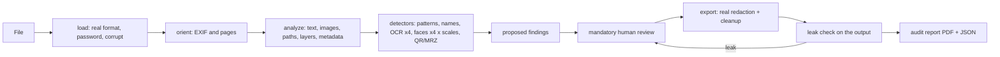

# Plan: local anonymizer for documents and images (CoP 33 / SmartGORE)

Status: **phase 0 finished, awaiting review.** This document summarizes what was built in
phase 0, proposes the plan for phases 1 to 3 and spells out the decisions I need you to make
before phase 1 starts (section 12). None of what follows is implemented in the engine yet:
phase 0 only built the test set and the metric.

---

## 1. Summary

**What was done in phase 0**

- The whole notebook (the CoP 33 notebook this project starts from) was read and its logic
  was run against a new test set, to measure what it covers and what it does not (section 2).
- A reproducible **test bench** was built (`test_bench/`, `scripts/generate_test_data.py`):
  102 fictitious files in 10 categories, with 971 precisely located personal-data items
  (polygons verified against the ink), 1 900 neutral reference texts, 44 hidden sensitive
  metadata items and 7 files that must be rejected. Separately, 28 real public documents of up
  to 5 pages (local only, with no ground truth) for experiments.
- On request, an **engine prototype** was also built (section 11.3), which already meets the
  acceptance criterion on the test set. It is a preview to look at results, not the phase 1
  engine.
- The **metric** was defined (`docs/metrics.md`): recall by type, and leaks checked in the
  output file through six independent routes. The evaluator validates itself with three
  baselines (identity, oracle and notebook).
- With primary evidence and independent adversarial verification, the following were
  verified: the licenses of every planned dependency, the face sources, the actual behavior of
  PyMuPDF and pdfium, and the Chilean formats of RUT (Rol Único Tributario, the national
  tax/ID number), phone, email and cédula (the national ID card).

**The most important things I found**

0. **The PDF the notebook produces keeps the full original text.** `doc.save(salida)` leaves
   the pre-redaction content stream inside the file as an orphan object: name, RUT, email,
   phone, address and URL are still there, readable with any PDF tool, even though the page no
   longer shows them and the notebook's check says "eliminados" (removed). The same happens
   with redacted images. It reproduces with the notebook's code unchanged:
   `uv run python scripts/demo_notebook_leak.py`. In 28 real public documents, 39 of the 60
   data items the notebook "redacted" were still recoverable. If anyone has used the draft,
   the fix is to save with `doc.save(salida, garbage=4, deflate=True, clean=True)`.
1. **PyMuPDF is licensed AGPL-3.0** (or under an Artifex commercial license). That clashes
   with your permissive-license policy and with the technical decision to use
   `apply_redactions`. There is a permissive path already proven in a prototype (pdfium). A
   decision is needed (D1).
2. **The notebook's phone pattern fully detects only 14 of 52 real ways of writing a Chilean
   number**: no regional landline (`(41) 221 3456`), no `22 123 4567`, no
   `+56-9-8123-4567`. For regional governments (GOREs, Gobiernos Regionales) it is the most
   serious gap.
3. **YuNet only detects faces well at roughly 10 to 300 pixels**: it fails on large portraits
   at full resolution and on small faces if the image is downscaled. Detection has to run at
   several scales. It also misses 2 of 3 pure profiles.
4. **OpenCV from PyPI on macOS ships GPL-3.0 FFmpeg**, linked in a way that cannot be removed.
   On Windows it can be removed. This affects the viability of macOS (D4: version 1 is Windows
   only).
5. **RapidOCR pulls in copyleft dependencies and code that uses the network** (model downloads,
   reading URLs). I propose using its models and porting only the inference (section 5.4).
6. **The Chilean cédula encodes the RUN (Rol Único Nacional, the personal ID number), the
   document number and the date of birth in its QR code and in the MRZ on the back**, which no
   text pattern detects. I propose QR and MRZ detectors (D7).

---

## 2. What we inherit from the notebook and what has to be fixed

We keep the notebook's whole philosophy: deterministic patterns, **recall over precision**
(the check digit only orders the review), checking up front that the PDF has text, real
redaction (deleting content, not covering it), verification by extracting the output's text,
a final sweep with the same patterns, a name list, and human review as a mandatory step.

These weaknesses were confirmed by running the notebook's code (the `notebook` baseline):

| Topic | What happens today | Evidence | Fix in phase 1 |
|---|---|---|---|
| Phones | 14 of 52 real formats fully matched; 0 regional landlines; false positives such as `Folio 2912345678` | test of 52 variants | broad digit candidates, normalization (+56, 0056, trunk 0) and classification by length; `anexo NNN` (extension) included |
| RUT | does not recognize the en dash (`12.345.678–5`), no hyphen, 9-digit bodies (`100.000.019-8`, MINEDUC) or body and check digit (DV) in separate columns | same | extended pattern; without a hyphen or with an invalid DV only near a label (RUT/RUN/C.I.) or in a table; OCR variants |
| Email | 16 of 31 variants; `[arroba]`, `(at)`, spaces around `@`, PDF line breaks and `©` read by OCR slip through | test of 31 variants | NFKC normalization, joining line breaks, a pass for obfuscations and OCR confusions |
| **Redacted text** | **a plain `doc.save()` leaves the original content stream inside the PDF, with all the text before redaction**, as an orphan object. The notebook's check only looks at the page text and does not see it | `scripts/demo_notebook_leak.py` with the notebook's code unchanged; on the test set, 141 of the 205 data items the notebook did find and cover are still in the file bytes | save with `garbage=4, deflate=True, clean=True` (or a new document) and verify the output bytes, not just the visible text |
| Redacted images | same as text: **the original unredacted image stays inside the PDF** | experiment: after redacting part of an image, the original JPEG was still in the file; with `garbage=4` it goes away | full rewrite of the file and a check that no original image survives |
| Searching for what was detected | `search_for(valor)` searches for the text again: if the finding crosses a line break (the RUT pattern allows `\s` around the hyphen) the area is not found, and the literal search for a name from the list fails if the PDF uses special spaces or hyphens (U+00A0, U+00AD). In both cases **the data item stays unredacted with no warning** | code review and research | use the boxes of each character of the finding itself, never search for the text again |
| Text off the page | `get_text()` clips to the visible page: text outside the box is not detected, but it is still in the file | experiment | extract without clipping and also redact off the page |
| Hidden layers | text in a turned-off optional layer does not appear in `get_text()` | experiment | reveal layers before detecting; remove layers and their names |
| Forms | the value of a form field survives redaction | experiment | flatten forms and annotations before redacting |
| Metadata | after redaction, the author is still in the metadata; XMP, annotations, attachments, JavaScript and bookmarks are not touched | experiment | full structural cleanup (section 6) |
| Saving | a plain `save()` keeps orphan objects (like the image in the row above) | experiment | full rewrite (`garbage=4`, `clean`) or a new document |
| Scans, images, faces | not processed (the notebook says so) | — | OCR, faces and pixel redaction |
| Verification | compares exact strings | code review | go over the output with the same detectors plus structural checks (section 7) |

**Figures for the `notebook` baseline** on the test set: overall recall 22.9 % (62.8 % on text
PDFs; 0 % on scans, images, ID cards and screenshots, which it does not process), 150 critical
leaks and 17 of 44 metadata items leaked. Full report in
`results/details/notebook/evaluation.md` (regenerated with the commands in section 11).

---

## 3. Architecture

```
anonymizer/
  engine/                # pure, typed library, no UI
    model.py             # Finding, Document, Page, Polygon, ReviewStatus, Decision
    loader.py            # format detection by content (not by extension) and understandable errors
    orientation.py       # EXIF, 0/90/180/270 rotations, coordinate transforms
    detectors/
      patterns.py        # RUT, email, phone, URL + OCR variants; check digit only for ordering
      names.py           # list of names and addresses with fuzzy matching (rapidfuzz)
      faces.py           # YuNet at several scales and orientations, box merging and expansion
      ocr.py             # PP-OCR detector, orientation and recognizer on onnxruntime
      codes.py           # QR and MRZ (proposed, D7)
    pdf/
      analysis.py        # page inventory: text, images, paths, layers, annotations, forms
      redaction.py       # real content removal (engine per D1)
      cleanup.py         # metadata, XMP, annotations, attachments, JavaScript, layers, bookmarks
    image/
      redaction.py       # polygon fill; pixel rewrite without metadata
    verification.py      # goes over the output with every detector and structural check
    report.py            # audit report (JSON and PDF)
    pipeline.py          # orchestration: analyze() -> findings; export(decisions) -> output + verification
    config.py            # thresholds, model paths, name list
    log.py               # technical log to a local file
  cli.py                 # anonymizer process input/ output/
  api/                   # FastAPI on 127.0.0.1, random port, uses engine/
  ui/                    # static frontend
  app.py                 # native window with pywebview
test_bench/              # development tool: generator, evaluator, baselines (not shipped)
tests/
test_data/               # generated by script (not versioned)
models/                  # ONNX (not versioned), with a download script and SHA-256 verification
```

**The finding** is the central object, the same in the engine, CLI, API, UI and report:

| Field | Content |
|---|---|
| `id` | stable identifier |
| `file`, `page` | where it is |
| `type` | `rut`, `email`, `phone`, `url`, `name`, `address`, `face`, `ocr_text`, `qr`, `mrz`, `manual` |
| `polygon` | list of points in page coordinates (unrotated PDF points, or pixels of the already-oriented image) |
| `text` | detected text, if applicable |
| `detector` | `regex`, `name_list`, `yunet`, `ocr`, `qr`, `reviewer`… |
| `score` | detector confidence (never decides whether something is redacted) |
| `doubtful`, `reason` | for ordering the review: invalid DV, low-confidence OCR, small face, profile, detected in a single orientation |
| `status` | `proposed` → `confirmed` / `removed` (with an optional reason) / `added` by the reviewer |
| `history` | changes with date and reason |



The engine processes page by page and exposes progress and cancellation, so the UI never
freezes and memory stays bounded (an A4 page at 300 dpi takes about 26 MB).

---

## 4. How each file type is processed

**Real format.** The type is decided by the first bytes, not by the extension. A password, an
empty, corrupt or unsupported file produce a clear message ("Este archivo está protegido con
contraseña", "This file is password-protected") and are listed in the report. A PDF with only a
permissions password is opened and processed (those restrictions protect nothing), and the
report mentions it.

**PDF with a text layer.**
1. Page inventory: text (without clipping to the page), optional layers (revealed),
   annotations and forms (flattened), images (with their location), vector paths.
2. Up-front warning about **fake redactions**: dark rectangles over text that is still
   extractable, and redaction annotations that were never applied. This is the classic
   transparency mistake; they are shown to the reviewer and the text underneath is detected
   like any other.
3. Patterns and names on the normalized text, with the geometry of each character.
4. Every embedded image: OCR and faces; the areas are mapped to page coordinates.
5. Text converted to paths: a page with almost no text layer is read whole by OCR, like a scan;
   on a page with a text layer, only the areas with many letter-like paths and few characters
   are rendered and read (D8).
6. Export: real removal of the content under each area (text, image pixels, paths),
   structural cleanup and a full rewrite of the file.

**Scanned PDF (no text layer) or mixed page.** The page is rendered at 300 dpi (200 dpi if the
page is very large), OCR and faces run with rotations, and the page is rebuilt as a redacted
image, without adding any text layer (D9). If it carries an invisible OCR text layer (a scanner's
"sandwich" PDF), that layer also contains the data: the redacted spans are removed from it along
with the pixels, and the rest of the layer stays as the original had it.

**Image (JPG, PNG, WEBP, multi-page TIFF).** The EXIF orientation is applied and detection runs
with rotations. The output is written from the pixels, in the same format and **with no
metadata at all**: no EXIF or GPS, nor the EXIF thumbnail (which keeps the original unredacted
image), XMP, IPTC or PNG text chunks. TIFF pages are processed one by one.

**HEIC.** Not supported in version 1 (D5): the only non-GPL reading library (pi-heif) is
LGPL-3.0, and phones and Windows convert HEIC photos to JPG. The app recognizes them (by
extension and by content) and asks for a JPG instead of calling them an unknown format.

---

## 5. Detectors

### 5.1 Patterns (RUT, email, phone, URL)

Base: the notebook's `PATRONES` (patterns), plus what the research showed is missing:

- **RUT**: a body of 1 to 9 digits with `.`, space, `,` or `·` separators; any hyphen
  (`-`, `–`, `—`, `‑`) or none; the labels RUT, RUN, R.U.T., C.I., "Cédula de identidad"
  case-insensitively. Without a hyphen or with an invalid DV, only next to a label or in a
  table (about 9 % of mobile numbers pass the DV when read as a RUT). The DV **never
  discards**: a RUT with an invalid DV is redacted and flagged as doubtful.
- **Phone**: every current area code (2, 32–35, 41–45, 51–53, 55, 57, 58, 61, 63–65, 67,
  71–73, 75, plus 44 for VoIP), mobiles, old formats with 0 and 09, old 8-digit numbers only
  next to a label (Fono, Tel., Cel., WhatsApp), extensions. 600/800 numbers are institutional:
  by default they are redacted anyway; the ones on the user's exceptions list are shown
  unapplied and the reviewer decides (D10).
- **Email**: NFKC, apostrophes, obfuscations (`[arroba]`, `(at)`, `arroba … punto cl`), PDF
  line breaks and soft hyphens.
- **Tolerance to OCR errors** (only on text that comes from OCR): O/o/D/Q→0, l/I/i/|→1, Z→2,
  S/$→5, B→8, g/q→9, `@` read as `©`/`®`, `.cl` read as `.c1`/`,cl`, extra spaces or periods.
  The literal reading is tried first and then the corrected one. If the corrected one
  validates the DV, confidence goes up; if not, it is redacted anyway.

### 5.2 Names and addresses

A list (one name or one address per line) with fuzzy matching: ignoring accents and case, in
any order ("Rojas Peña, Ana María"), partial (first name and first surname), and tolerant to
OCR errors (bounded edit distance with rapidfuzz). Names that are not on the list **are not
detected**: this is a documented limit, and the test set measures it on purpose.

### 5.3 Faces

- YuNet (`face_detection_yunet_2026may.onnx`, MIT; dynamic input intended for OpenCV 5).
- EXIF orientation first; then 0°, 90°, 180° and 270°. The boxes go back to the original
  coordinates and are merged.
- **Several scales** (a research finding): YuNet works with faces of about 10 to 300 px.
  Detection runs with the long side at 640 and at 1280 px and, for small faces, on tiles at
  full resolution. In the test, a portrait at 2048 px produced wrong boxes and at 640–1280 px
  produced the correct box.
- Low threshold (recall), box merging and a 20 % expansion to cover hair and ears.
- Profiles: YuNet missed 2 of 3 pure profiles and mistook ears for faces. I propose measuring
  a second, permissively licensed detector in phase 1 (OpenCV's profile classifier) and
  flagging as doubtful the images with people but no detected face.
- Intermediate angles: if recall drops at 45° (likely), passes at 45°, 135°, 225° and 315° are
  added. YuNet is fast, so the cost is low; it is decided with the phase 1 numbers.

### 5.4 Text in images (OCR)

- PaddleOCR models in ONNX (Apache-2.0), via RapidOCR: detector, orientation classifier and
  recognizer. The `rapidocr` 3.9.2 package ships PP-OCRv6 *small* (a 9.9 MB detector and a
  21.2 MB recognizer) and the 0.6 MB 0/180 classifier. The recognizer is multilingual and
  includes every accented letter, ñ/Ñ, ü, ¿, º and ª (it lacks only ¡). In a synthetic test it
  read lines with a RUT, an email, a phone and "Peña Muñoz" without errors at 0°, 15° and 180°,
  and failed at 90°: the 4 rotations are needed. In another test, the PP-OCRv5 *mobile*
  detector found 5 of 5 lines and the PP-OCRv6 ones 4 of 5; the choice is made with the test
  set in phase 1. The recognizer also returns per-word quadrilaterals, which makes it possible
  to redact only the RUT and not the whole line.
- **Proposal for a concrete problem:** do not use the `rapidocr` package as-is. It requires
  OpenCV with a GUI (Qt and FFmpeg), shapely (GEOS, LGPL), requests/certifi and tqdm (MPL), and
  it has code that downloads models and opens URLs. Instead, port only the inference
  (preprocessing, detector postprocessing, classifier, recognizer decoding; about 400 lines
  with Apache-2.0 attribution) on top of onnxruntime, numpy, headless OpenCV and pyclipper
  (MIT). That way there is no network code in the application and the polygon output is under
  our control.
- Orientation classifier enabled, plus the 4 rotations of the whole image; the polygonal boxes
  (rotated quadrilaterals) go back to the original coordinates and are merged.
- Redaction uses the detector's **rotated polygon**, not its bounding rectangle.
- A "redact all text in this image" mode, which can be enabled per file.
- Mirrored text (photo taken with a front camera): the 4 rotations do not read it. The mirrored
  image is read too, only when the normal pass finds no legible text (D6).

### 5.5 QR and MRZ (proposed)

The cédula's QR code encodes a URL with the RUN, the document number and the date of birth.
The MRZ on the back (3 lines of 30 characters) contains surnames, given names, RUN and dates
without dots or hyphens. OpenCV decodes QR codes without the network (Apache-2.0), and the MRZ
is recognized by its shape in the OCR text. I propose always redacting the whole block (D7).

---

## 5.6 Nothing leaves the computer

- The application code makes no network calls. RapidOCR has no telemetry, but it does download
  models from ModelScope if a file is missing or its SHA-256 does not match, and it opens images
  from URLs. Once the inference is ported (5.4), that code does not exist.
- **onnxruntime ships telemetry.** On Windows it logs Microsoft ETW events; it is disabled with
  `onnxruntime.disable_telemetry_events()`, and what gets sent depends on the Windows
  diagnostic settings. On macOS, since version 1.29, it uploads events over HTTPS to Microsoft
  and stores a machine identifier unless `ORT_DISABLE_TELEMETRY=1` is set before importing it.
  Both measures go at program startup, with a test.
- **WebView2 (pywebview's window on Windows) connects on its own**: in the test it requested
  Edge's experiment configuration and looked for a proxy (WPAD), while showing only
  `http://127.0.0.1`. With hardened startup arguments those two connections go away, but one
  TLS connection from the WebView2 process to Microsoft servers remained. It came from the
  Windows-account sign-in, and turning that feature off (`msOneAuthWAM`) removed it. Documents
  never travel through WebView2's channels, but "zero traffic" cannot be claimed for the Windows
  component: its updates, its crash reports and Windows' own checks are outside the app (D11;
  README, "Network traffic").
- Short install paths: with long paths (such as OneDrive's) Windows fails to load native
  libraries.

## 5.7 Signatures

Implemented (2026-10-05): detection group `signatures` ("Firmas", on by default, section 8.1),
module `anonymizer/engine/signatures.py`, findings of type `signature` with detector `signatures`.
**Every signature finding is doubtful** ("Posible firma: revisa el original"), including the
"Firma" column zones of the context rule (D13), which were not doubtful before.

**No model: rules.** The decision was "try and measure": our own rules, and an open pretrained
model if one could run offline with onnxruntime under a license compatible with the AGPL. No
model passed the license review, which covered the weights, the code they come from and the
data they were trained on (primary sources: model and dataset cards, the IIT-CDIP paper):

| Candidate | Weights / code | Training data | Verdict |
|---|---|---|---|
| tech4humans `yolov8s-signature-detector` (ONNX, 44.6 MB, gated) | AGPL-3.0 / Ultralytics AGPL-3.0 | tech4humans/signature-detection: Tobacco800 + Roboflow `signatures-xc8up` | rejected: Tobacco800 comes from the tobacco litigation documents (IIT-CDIP), whose copyright was never cleared; the Roboflow upload has no documented origin |
| tech4humans `conditional-detr-50-signature-detector`, mdefrance `yolos-*-signature-detection` (and the onnx-community conversion) | Apache-2.0 | the same dataset | rejected, same reason |
| Mels22 `Signature-Detection-Verification`, victordibia `signver` | Apache-2.0 / MIT (YOLO11 code is AGPL) | SignverOD (CC0, but built from Tobacco800, NIST forms, an unnamed cheque dataset, GSA leases) | rejected: Tobacco800 and an unnamed source |
| liberty666 `yolo11n-chinese-signature` | MIT declared | ChiSig, no license found | rejected |
| bluecopa `rf-detr-stamp-signature-detector` | Apache-2.0 | "~9 400 images merged from multiple sources", none named | rejected |
| nutrientdocs `form-field-v1-nano` (ONNX, 3.7 MB) | Apache-2.0 | synthetic forms, provenance of templates and handwriting not documented | rejected; it also detects signature *fields*, not signatures |
| A dozen community YOLO/DETR models on Hugging Face, Roboflow Universe models and datasets, the Ultralytics Signature dataset | various | not documented, or user uploads of unknown origin | rejected |
| Layout models (DocLayout-YOLO, DocLayNet, PP-DocLayout) and open-vocabulary detectors | permissive | no signature class, or RVL-CDIP (tobacco documents); Grounding DINO's GoldG includes Flickr30k (non-commercial) | rejected |

The only clean route to a model would be to train one on synthetic signatures over documents
of known license; it can be revisited if someone publishes a detector with documented,
permissive training data.

**What the rules look for.**

- *Raster* (scanned pages, photos, images placed on text pages): pen strokes, that is, ink that
  printed text does not explain (not inside a line OCR read with confidence ≥ 0.8, or much
  larger than its letters), at least three letter heights long, thin, curved, and neither a
  straight rule, a hollow ring or frame (stamps), a grid of short axis-parallel runs (QR codes,
  tables), a filled shape nor part of a texture (dense ink around it: photos). A stroke counts
  near a short line with a keyword (`firma`, `firmado`, `firmante`, `V°B°`/`VºBº`/`Vo.Bo.`,
  `p.p.`, in any orientation, also in the text layer next to an image), over a straight
  signature line of a document that is not part of a table grid, or inside a small image of a
  text page (a scanned signature pasted into a Word document). Next to a keyword, letters
  written apart count too. Over a signature line, a stroke that OCR read as part of a line of text
  (however unsure) counts only on the side opposite a printed line next to the rule (the signer's
  name or role): a title in a script font over a decorative rule does not. On a plain sheet of
  paper (light, even background, sparse ink), a large curly stroke outside every line OCR read
  counts by itself. An image repeated at the same place on several pages is taken for a
  letterhead's emblem (never a signature by itself, and a lone stroke in it does not count) unless
  something marks it as a signature, in the page as it is shown: a keyword next to it, a signature
  line under or across it (drawn or typed, shorter than 60 % of the page's width: a page-wide
  header rule is not one), or a person's name right under it. Then it is the same signature on every page
  (certificates signed by the same official, initials on every sheet) and is looked at like an
  image placed once. In a table, the column under a
  "Firma" header is a zone down to the last row (rows must have cells under two or more
  headers, which also rejects the same table read upside down by the 180° classifier). A zone
  covers the stroke and the marks that touch it (the letters of a name it crosses and their
  accents) but not the keyword label; overlapping zones are joined, also with the context
  rule's column zones.
- *Vector* (text pages of a PDF): clusters of curved paths (Bézier curves, or polylines of six
  segments or more that are not axis-parallel) closer than a letter height. A stroked cluster
  counts next to a keyword or a drawn or typed signature line (curliness ≥ 1.5, the pen turns
  back left or right), or by itself when it is long and curly (≥ 12 curves, length ≥ 1.8 times
  its extent, ≥ 6 turn-backs: a chart never turns back); filled outlines only next to a keyword
  or a line. Closed convex outlines (rings, ovals, rounded boxes: seals, radio buttons) are never
  part of one. A page whose text runs vertically in PDF space (a landscape page stored as
  portrait plus /Rotate, a table printed sideways) is analyzed transposed. With the context rule
  for names off, the "Firma" column of a text-layer table is found here too.
- *Annotations and digital signatures*: ink annotations, stamps and signature fields are removed
  with every annotation and form field on export (section 6); they are not findings.

**Real redaction of drawn signatures** (`anonymizer/engine/strokes.py`). MuPDF's redaction
removes the *filled* paths a zone covers but keeps *stroked* ones: a signature drawn with a pen
tool stayed in the file under the black box; and its option to remove every path a zone
*touches* also removes page frames, cell shading and background bands. So stroked paths are
handled apart. The rule is principle 1 (recall over precision): the stroke logic stays silent only
when it is certain that a stroke is not under an applied zone or that it left the file; when a
classification would be a guess, the export is blocked with a message that says what to do. A
false block is acceptable, a silent leak is not.

- Each stroked path is judged by its box cut to the clip that shows it; a path clipped away
  entirely, by where it is drawn (its data is still in the file). A path whose box lies inside an
  applied zone (within 1 pt of its edge) leaves the file. Rectangles and straight horizontal or
  vertical rules are page layout and stay, and so do closed convex outlines (rings, ovals, rounded
  frames: stamps, frames) with less than half of their length under the zones. Any other curve or
  polyline that crosses the edge of a signature zone or of a zone drawn by the reviewer leaves
  whole when at least 60 % of its visible length lies under the zones, and blocks the export from
  20 % ("un trazo dibujado cruza el borde de la zona…; agranda la zona para cubrirlo entero"),
  chart curves included. Any other stroke that is not page layout with at least 80 % under the
  zones blocks with the same message (a zone of text data a hair short of a drawing). Each stroke
  removed whole is recorded in the export result and in the audit report ("Trazos dibujados
  quitados enteros"), since the page changes outside the zone.
- Nothing is exempted for being a pattern's cell or a glyph: `get_drawings` lists them as paths.
  What the redaction cannot remove under a zone blocks (MuPDF removes a pattern fill or a glyph it
  covers entirely, and with them what they paint).
- Removal goes through MuPDF's content filter, whose callback only sees the box of what it paints,
  one call per subpath, in content order, clips included. A first pass records the calls and lines
  them up with `page.get_drawings(extended=True)`, which lists whole paths and clips in the same
  order: a fill or a clip with the same box, a stroke with the same box grown evenly on every side
  (by half the line width, or by the width times the miter limit, which is not listed: any even
  growth fits), looked up through an index of box centers and sizes, never by scanning the page.
  A clip without painting (`W n`) takes its clip entry; a shape filled or stroked with a pattern,
  listed only as a clip with its box and its cell, takes that clip. The second pass drops only the
  calls matched to a planned path, and the painted calls `get_drawings` does not list (a
  pattern-painted shape) whose box lies inside a zone. A pattern-painted shape that touches a zone
  without lying inside it blocks the export ("…un trazo o relleno con trama que no se puede revisar
  ni quitar por partes…"). The filter does not enter Type3 glyph procedures, which every page
  using the font shares, nor the cells of patterns; each use of a form is filtered as its own copy.
  Afterwards the page's paths and text, and what the filter painted, must be exactly the expected
  ones; otherwise the page is put back as it was, nothing is removed, and the leak check blocks the
  export ("…no se pudo quitar sin alterar el resto de la página…"). A path that is also a clip
  (`W S`) is never dropped: under a zone it blocks with that message.
- The leak check plans again over the exported file (each page unrotated in memory, like in the
  redaction) with the same rectangles and rules and blocks the export when a stroke that should
  have left (other than page layout, such as the black boxes themselves) is still there, when a zone
  must cover a whole stroke, or when a painted shape `get_drawings` does not list touches a zone.
- Every page has one time budget of 15 s for the whole stage (listing, planning, lining up); past
  it nothing is removed and the export is blocked ("…no terminó a tiempo…"). A page with 9 000
  pattern fills and 9 000 squares on one center now exports in about 5 s.
- The filter uses private PyMuPDF bindings: at startup `strokes.self_test()` removes a stroke drawn
  by a form from one page and checks that the frame around it, the same form on another page and a
  Type3 glyph drawn with a stroke inside the zone stay, and that the filter reports no glyph
  procedure; a filter that edits shared forms in place or enters glyph procedures fails it, and the
  real engine refuses to start. PyMuPDF is pinned below 1.29 (`pyproject.toml`).

Found in three independent reviews (2026-10-05 and 06) with invented documents. The first version
matched the filter's boxes loosely: it removed a frame 3 pt outside a zone, a filled panel
around a signature and a table cell's shading under a highlighted name, could enter Type3 glyph
procedures, and left strokes partly under a zone in the file silently. The second fixed that but
lined calls up by scanning (a page with 3 000 pattern fills took about ten minutes), blocked
exports for rounded frames and ring stamps, missed polylines with a high miter limit, left a stroke
a hair past a text zone silently, and stopped looking at a signature image repeated on every page.
The third found that exempting pattern cells could hide a real signature (a signature clipped to
a hatched box, in a form, or painted as a pattern's tile), that signature flourishes crossing a
zone with less than 60 % inside stayed silently, that two copies of a stroke at the same place
were mismatched, that a page-wide header rule anchored a repeated logotype, and that anchors
ignored /Rotate. It also showed that the filter reports one call per subpath (a table shaded as one
path of many rectangles, a signature drawn as several subpaths) and a stroke painted with a
pattern only through its paint call. Each case is a regression test (`tests/test_strokes.py`,
`tests/test_signatures.py`).

**Results** (test set of 102 files, prototype baseline, 3 processes; before = the same engine
without signatures):

| Measure | Before | After |
|---|---|---|
| Signature recall (12, all `out_of_scope`) | 0 % (0) | 91.7 % (11) |
| Recall and leaks of every other type and level | — | identical |
| Total leaks (critical) | 43 (0) | 32 (0) |
| Signature zones on files without signatures | 0 | 0 |
| Signature zones that touch no signature | 2 (context rule) | 2 (the same two) |
| Neutral texts covered ≥ 50 % (all zones) | 287 of 1 862 | 290 |
| Signature stage, whole set (one analysis at a time, cached OCR) | — | 12.1 s for 95 files |

The miss is the card photographed with glare and motion blur: OCR does not read its "FIRMA DEL
TITULAR" label, the signature is read as text, and a card on a table is not a plain sheet. The
two zones that touch no signature are the context rule's "Firma" column read on a tilted photo
and on a page scanned sideways; they existed before and are now doubtful. The three extra
neutral texts are under the zone of the signature with a stamp pressed on it (the stamp joins the
signature, and the zone reaches the signer's role line). Time: about 0.006 s per text page
(vector paths), 0.2 s per scanned page and 0.13 s per image on the development machine; during
the bench run, with the machine loaded by other work (OCR itself took 2.2 times longer than in
the run before), the stage was 29.5 s of 2 526 s of analysis (1.2 %). After the review fixes the
bench gives exactly the same detections and no export is blocked; on a quieter machine the stage
was 9.7 s of 938 s of analysis (1.0 %), and export took 60.4 s for the 95 files against 56.8 s
without signatures (the stroke plan and its leak check).

Beyond the 12 signatures of the set, `tests/test_signatures.py` builds a synthetic set: 32
fictitious signatures, every pair of style (pen strokes with loops and flourishes, or a name in
an italic font crossed by a stroke; blue or black), anchor (under a label, over a signature line,
alone, or with "V°B°") and geometry (upright, grainy paper, tilted up to 30°, scanned sideways)
twice, and 10 pages without signatures (tables, stamps, charts, photo-like blocks, forms with
"Firma:"). All 24 pen-stroke signatures are found, 6 of the 8 typed ones (all those next to a
keyword or a signature line), and no page without a signature gets a zone. An earlier run of 64
and 20 pages gave the same picture (48 of 48, 11 of 16, 0 of 20). The tests also hold the cases
of the review: a landscape page stored as portrait plus /Rotate, a vector seal next to "V°B°", a
script-font title over a rule, an emblem repeated on every page, a "Firma" column of a
text-layer table with context names off.

## 6. Real redaction and cleanup

Regardless of the PDF engine chosen (D1), the contract is the same:

- **PDF**: the content under each area is removed: characters, image pixels (including images
  with transparency, CMYK, 1-bit and inline images) and paths. Forms and annotations are
  flattened. Metadata, XMP, attachments, JavaScript, layers and their names, bookmarks, page
  labels, thumbnails and `ActualText`/`Alt` are removed. The file is fully rewritten, with no
  previous revisions or orphan objects, and without a password.
- **Image**: solid fill of the polygon (faces: solid fill by default; strong pixelation
  optional, with blocks of at least one sixth of the face width). The output image is created
  from the pixels, without metadata.
- What the PyMuPDF research left as rules (they apply if PyMuPDF is used):
  `add_redact_annot` with a rotated quadrilateral redacts its bounding rectangle (several small
  rectangles are used instead); grow each area by 1–2 pt; `scrub()` with its defaults fails on
  annotation replies, deletes the OCR layer of scans and does not erase pixels when applying
  pending redactions, so it is called with explicit parameters and completed by hand; redacted
  images are left uncompressed unless the file is saved with `deflate=True`; `apply_redactions`
  removes the filled paths a zone covers but not the stroked ones, which are removed apart
  (`strokes.py`, section 5.7).

---

## 7. Leak check

After exporting, the engine opens the output and goes over it:

1. The same detectors on the output: patterns and names on the text extracted by **two
   independent engines** (pdfium also extracts hidden and off-page text), OCR and faces on the
   rendered pages.
2. A search for every redacted value in the file bytes, in the decompressed streams and in the
   strings of every object.
3. Structural checks: metadata, annotations, attachments, layers, JavaScript, previous
   revisions, EXIF, thumbnail, XMP and the image's text chunks.
4. Under each redacted area, that no image with the original pixels remains under the fill.

Anything that shows up is a **leak**: it is shown in red in the review, blocks the export of
that file until the reviewer resolves it, and is recorded in the report. The app never says
"documento limpio" ("clean document"); it says "revisión lista para confirmar" ("review ready
to confirm").

---

## 8. Human review and report

Phase 2 in detail, with a mockup first for your approval. In short:

- A review screen with a viewer, areas colored by type and a side list of findings with the
  **doubtful ones first** (invalid DV, low-confidence OCR, small or profile faces, detected in
  a single orientation).
- Add areas by drawing; **removing an area requires confirmation and is logged**, with an
  optional reason.
- Audit report (PDF and JSON): what was redacted, where, by which detector, what the reviewer
  changed and the result of the leak check. The JSON follows the contract used by the test
  bench evaluator, so the app can be evaluated as-is.

### 8.1 Choosing what to search for, and how long it takes

Implemented (2026-10-01). Before processing, the user chooses which groups of detections run
(screen 1, panel "Qué buscar"). One source of truth: `anonymizer/engine/model.py`
(`DETECTION_GROUPS`, with the Spanish label, description and warning, and `DetectionOptions`).

| Group (`key`) | What it covers | Default |
|---|---|---|
| `patterns` | RUT, email and phone | always on (locked) |
| `urls_personal` | personal URLs (D12) | on |
| `urls_other` | not a detection: whether the other URLs start applied (D12) | off |
| `names_list` | names and addresses of the user's list | on |
| `names_context` | names by context: given-name dictionary, signatures, tables, "Nombre:" (D13) | on |
| `ocr` | text in scans, photos and images inside PDFs | on |
| `faces` | faces | on |
| `signatures` | handwritten and drawn signatures, always doubtful (section 5.7) | on |
| `qr` | QR codes | on |

- `patterns` cannot be turned off: the leak check runs those patterns again over every output
  and D2 requires zero base-level leaks of them (the API answers 400).
- A group that is off **skips its work**, it does not just hide results: with OCR off there is
  no OCR pass, so scanned pages and images get no text-based finding at all (patterns, names
  and URLs in pixels are not read); faces, signatures and QR off do not call their detectors;
  with OCR, faces, signatures and QR off no page is rendered (signatures read pixels without
  OCR: strokes and signature lines; with OCR off they lose the keyword labels of scans and
  photos). `names_list` off: the entries are not searched (context
  names are still found, all of them doubtful). `names_context` off: no given-name dictionary
  and no name or signature context rules (the `signatures` group still finds "Firma" columns);
  the context rules for RUT, email, phone and address stay with the patterns. With every group on and the other URLs applied, the findings are
  exactly the ones of the engine before this change (checked on 16 files of the test set).
- The choice lives only in the session: every start of the app goes back to the defaults
  (recall over precision; nobody finds a group off by surprise). Each file records the groups
  it was processed with; the review screen shows "En este archivo no se buscaron: …" when some
  were off (and says plainly that nothing inside the images was searched when OCR was off), and
  the audit report lists the groups that were on and off.
- The engine measures the real time of each stage (`AnalyzedFile.timings`): `text` (text layer,
  patterns, names, context), `render` (rendering a page or decoding an image for OCR, faces,
  signatures or QR), `ocr`, `faces`, `signatures` (also the vector paths of text pages), `qr` and
  the total `analyze`. Time spent waiting for a lock held by
  another analysis (OCR, faces, PyMuPDF) is left out of the stage; two analyses still share the
  processor, so a stage can be slower while another file runs, and that is not subtracted.
- **Estimate.** `engine.profile(file)` reads cheap facts without rendering anything (pages,
  scanned pages, the images of text pages and their size, frames and megapixels of an image), and
  `engine/estimate.py` multiplies them by a few seconds-per-unit rates. The defaults were
  measured on the development machine (table below). After every analysis the rates move
  towards the measured times (exponential moving average, weight 0.3, each rate in proportion to
  its share of its stage) and are saved in `%LOCALAPPDATA%/Anonimizador/estimates_<engine>.json`:
  only those numbers, never file names or content. The UI shows the time per group and the total
  for the groups that are on ("Tiempo estimado: ≈ 1 min 20 s · depende del computador"), and each
  finished file shows its measured time per stage.

Default rates (seconds per unit), fitted to the stage times of the 95 readable files of the test
set on the development machine (one analysis at a time, every group on). With them the estimate
of the whole set is 427 s against 486 s measured; per file, the median ratio estimate/measured is
0.98 (10 % of the files below 0.52, 10 % above 2.25: OCR time depends on how much text there is).

| Stage | Unit | Seconds |
|---|---|---|
| text | PDF page | 0.075 |
| render | rendered PDF page (scanned or with images) / megapixel of an image | 0.14 / 0.02 |
| ocr | scanned page | 10 |
| ocr | distinct image on a text page / its megapixels at 200 dpi | 1.45 / 1.9 |
| ocr | frame of an image file (photos about 2 s, screenshots about 10 s) | 3.5 |
| faces | scanned page / image on a text page / megapixel of an image | 1.2 / 0.15 / 0.35 |
| signatures | PDF page with text / scanned page / image on a text page / megapixel of an image | 0.006 / 0.22 / 0.03 / 0.12 |
| qr | rendered PDF page / megapixel of an image | 0.1 / 0.02 |

The signature rates were fitted the same way when the group was added (2026-10-05), on its own
stage (12.1 s measured, 10.7 s estimated for the 95 files).

---

## 9. Performance and memory

- Measured in phase 1 with the test set, limiting onnxruntime and OpenCV to 4 threads to
  approximate an ordinary PC. The development machine is more powerful (i7-13620H, 16 GB), so
  both figures will be reported.
- Initial targets, to be discussed with the numbers in hand: standalone image ≤ 5 s; scanned
  page ≤ 10 s; text page ≤ 1 s (without page OCR); peak memory < 2 GB.
- The dominant cost will be OCR with 4 rotations (or 8, with mirroring). If time clashes with
  recall, I will present it as a decision with figures, not settle it silently.

---

## 10. Next phases

**Phase 1: engine and CLI.**
1. Data model, loading and understandable errors.
2. New patterns, with unit tests for the 52 phone variants and the RUT and email ones.
3. Names with fuzzy matching.
4. Ported OCR and faces at several scales and orientations.
5. PDF: inventory, real redaction, cleanup (per D1).
6. Images and TIFF.
7. Leak check.
8. JSON report (compatible with the evaluator) and CLI.
9. Measurement of recall, leaks and times with `test_bench.evaluate`.

Acceptance criterion: the one in `docs/metrics.md`, section 5.

**Phase 2: API and UI.** First, a mockup of the review screen for approval. Then the local API
(127.0.0.1, random port, session token), the UI (start, cancellable progress, review,
export), light and dark mode, AA contrast, full keyboard navigation, and everything in Chilean
Spanish.

**Phase 3: packaging.** PyInstaller in folder mode (keeps any accepted LGPL or MPL libraries
replaceable). The `.spec` excludes OpenCV's FFmpeg DLL, reportlab's GPL fonts and everything
development-only, and a test fails if they show up. The bundle must include `LICENSE` at its
root (next to the `anonymizer` package also works): the "Acerca de" dialog shows it
(`anonymizer/about.py`, `GET /api/about`) and only points to the source when it is missing.
Also: `LICENSES.md` generated from the actual license files, a test that there is no network
traffic, the final size, `README.md` with screenshots and `DEVELOPMENT.md`. Windows only (D4:
macOS is not a version-1 target).

---

## 11. Test set and metric (phase 0 deliverables)

### 11.1 Fictitious test set (`test_data/generated/`)

| Category | Files | Personal data | Metadata | What it exercises |
|---|---|---|---|---|
| Text PDF | 12 | 292 | — | every RUT, phone and email format; page with `/Rotate 90`; rotated text; tiny text, white on white, under an image and off the page; text converted to paths; embedded images, QR |
| PDF with metadata | 4 | 28 | 17 | Info, XMP, annotations, attachments, hidden layer, form, bookmarks, JavaScript, incremental revision, fake redaction, PDF with a permissions password |
| Scanned PDF | 8 | 107 | — | 300/200/150 dpi, skewed, upside down, sideways, with a photo, mixed, OCR sandwich, stamp, signature, handwriting |
| Rotated image | 17 | 84 | — | 0/90/180/270/15/45°, mirror, noise, 12 px text, low contrast |
| EXIF | 8 | 33 | 23 | orientations 3/6/8 and wrong EXIF, GPS, thumbnail, XMP, IPTC, PNG and WEBP |
| TIFF | 2 | 22 | 4 | multi-page with pages of different size and rotation, 1-bit |
| Fictitious cédula | 7 | 45 | — | flat, photographed in perspective, rotated 30°, with glare, back with MRZ and QR, PDF with both sides |
| Screenshots | 7 | 192 | — | email, mobile chat, spreadsheet (also downscaled to 8 px), web form, high density |
| Faces | 30 | 168 | — | frontal, three-quarter and profile portraits; rotated; groups from 22 to 190 px; 9 real photos; poster; occlusion; low resolution |
| Errors | 7 | — | — | password, corrupt, empty, fake format, truncated image, .docx |

Faces: Face Research Lab London Set (CC BY 4.0, with consent), Open Images V7 (CC BY 2.0) and
US public-domain portraits. Details and attributions in `LICENSES.md`.

### 11.2 Validating the evaluator

| System | Recall | Critical leaks | Metadata leaked | Errors correctly rejected |
|---|---|---|---|---|
| identity (unchanged copy) | 0 % | 397 (all) | 44 of 44 | 0 of 7 |
| oracle (redacts using the answer) | 100 % | 0 | 0 | 7 of 7 |
| notebook | 22.9 % | 150 | 17 of 44 | 0 of 7 |

Identity flags everything as a leak (the evaluator is not blind to any case) and the oracle
flags nothing (the ground truth and the coordinates are correct).

### 11.3 Engine prototype (preview)

`test_bench/baselines/prototype.py`: extended patterns on the geometry of each character, name
list, OCR (PP-OCRv6) at 0/90/270° plus the 180° classifier, YuNet in 4 orientations and 2
scales, QR, real redaction and full cleanup. Result on the test set:

| Type (base level) | Recall | Leaks |
|---|---|---|
| RUT (112) | 100 % | 0 |
| Email (155) | 100 % | 0 |
| Phone (130) | 100 % | 0 |
| URL (23) | 100 % | 0 |
| Name from the list (160) | 100 % | 0 |
| Address from the list (35) | 100 % | 0 |
| Face (161) | 96.9 % | 5, all in real crowd photos |

Metadata leaked: 0 of 44. Errors correctly rejected: 7 of 7. **Verdict on the phase 1
criterion: PASSED.** Under stress: RUT 81 %, email 89 %, phone 93 %, faces 100 %. Out of scope,
as expected: names not on the list and signatures. Since 2026-10-05 the engine finds signatures
by rules: 11 of the 12 of the set (section 5.7), with no change in any other type.

What is missing for it to be the phase 1 engine: redacting only the data item and not the whole
OCR line (today it covers 13 % of the neutral text), its own leak check, the PDF engine per D1,
times (median 12 s per image and up to 100 s per scanned page on this loaded machine), small
faces in crowds, and everything in section 10.

The bench runs the engine with every detection group on and the URLs that are not personal
applied (`DetectionOptions.everything()`, section 8.1), so its numbers stay comparable with the
runs made before the groups could be chosen and before D12 left those URLs unapplied by default.

**Metric**: see `docs/metrics.md`.

**How to regenerate**:

```
uv sync --group data
uv run python scripts/generate_test_data.py        # test_data/generated/ + manifest.json
uv run python -m test_bench.baseline oracle --manifest test_data/generated/manifest.json --output results/details/oracle
uv run python -m test_bench.evaluate --manifest test_data/generated/manifest.json --redaction-report results/details/oracle/report.json --outputs-dir results/details/oracle/files --report-dir results/details/oracle
uv run python -m test_bench.visualize test_data/generated/manifest.json --output results/details/overlays
uv sync --group prototype --group data   # for the prototype (OCR and faces)
uv run python -m test_bench.baseline prototype --manifest test_data/generated/manifest.json --output results/details/prototype --processes 5
uv run python -m test_bench.compare          # sheets in results/examples
uv run python -m test_bench.process_folder <folder with documents> --output results/gore
```

---

## 12. Decisions I need

**D1. PDF engine: PyMuPDF (AGPL) versus the license policy.** This is the main clash.

| Option | Advantages | Costs and risks |
|---|---|---|
| **A. pdfium (BSD/Apache) + pypdf (BSD) + fallback rasterization** | Respects the policy. A prototype already removed text for real, even part of a line, and rewrote image pixels without leaving a trace in the file. | About 3 to 6 more days of development. Unusual fonts (Type3, no character map) may not be rebuilt: those pages are rasterized automatically. The glyphs of the embedded font stay in the file (it reveals which letters are used, not the text). |
| B. PyMuPDF with an Artifex commercial license | It is the most proven engine (`apply_redactions`); the original technical plan works as-is. | Paid license (per copy or subscription, with a quarterly minimum) and a purchasing process. |
| C. PyMuPDF under AGPL | No cost and no extra work. | The whole application becomes AGPL and every delivery to another agency requires offering the complete source code. It contradicts your policy. |
| D. Always rasterize | The simplest and safest. | The text layer is lost: the PDF is no longer searchable or accessible, and it is larger. |

**My recommendation: A**, with automatic rasterization of the pages the verification cannot
confirm, and full rasterization as a "maximum security" mode. If there is budget and you
prefer the most proven engine, B. PyMuPDF stays only in the test bench (not shipped).

> **Decided (2026-10-01): option C.** The tool is free, for internal use, and its source is
> public on GitHub, so the AGPL is easy to comply with. PyMuPDF stays as the PDF engine and the
> whole project is licensed under **AGPL-3.0-or-later**. When the application is given to
> another institution, it ships with the license text and a notice pointing to the source code
> of that exact version.

**D2. Scope of "zero leaks".** I propose that the phase 1 acceptance criterion apply to the
`base` level in **every** category (text PDF, scans, images rotated at 0/90/180/270/15/45°,
cédula, screenshots, TIFF), and that the `stress` cases (8 px text, mirrored, 150 dpi fax, old
formats, obfuscations) and the `out_of_scope` ones (names not on the list, signatures,
handwriting) be reported without blocking. Do you confirm?

> **Decided (2026-10-01): yes.** Zero leaks at the `base` level in every category.

**D3. Weak-copyleft licenses.** Is any LGPL or MPL component acceptable if its license is
complied with and it stays replaceable (for example certifi, or Eigen inside onnxruntime, which
is header-only MPL)? Is the Intel IPP license (not OSI) that comes inside OpenCV for Windows
acceptable? If the answer is "strictly MIT/Apache/BSD", we build OpenCV without FFmpeg or IPP.

> **Decided (2026-10-05): weak copyleft is acceptable** when its license is complied with and the
> component stays replaceable: its license text ships with the executable, `INDEX.txt` says where
> its source code is, and the one-folder packaging keeps it as separate files that can be swapped
> (`scripts/collect_licenses.py`, `COPYLEFT_SOURCES`). What the Windows build bundles today under
> those terms: GEOS (LGPL-2.1, the DLLs in `Shapely.libs/`, pulled in by rapidocr through shapely),
> certifi and tqdm (MPL-2.0, also through rapidocr) and Eigen inside onnxruntime (MPL-2.0, headers
> compiled in, notice kept). OpenCV's FFmpeg DLL (LGPL) is not bundled: the spec drops it and
> `scripts/build_exe.py` fails the build if it shows up. Porting the OCR inference (5.4) is still
> worth doing to remove rapidocr's network code, but no longer for licensing.
>
> **Intel IPP stays open: it is not weak copyleft, so D3 does not settle it.** The build bundles
> `cv2.pyd` from opencv-python-headless 5.0.0.93, which links Intel IPP ICV 2026.0.0 statically
> (`cv2.getBuildInformation()`: "Intel IPP: 2026.0.0", "3rdparty dependencies: … ipphal ippiw
> ippicv"); its terms (Intel Simplified Software License) ship in OpenCV's
> `LICENSE-3RD-PARTY.txt`. `build_exe.py` cannot drop or check it, since it is inside `cv2.pyd`.
> The fix, once decided, is an OpenCV built with `-DWITH_IPP=OFF`, or YuNet and the OCR
> preprocessing without OpenCV (LICENSES.md, section 1).

> **Decided (2026-10-06): accepted for version 1 and documented as a known risk.** `cv2.pyd`
> (opencv-python-headless) links Intel IPP ICV statically under Intel's proprietary license (the
> Intel Simplified Software License: free redistribution, but not free software; it forbids
> modifying and reverse engineering IPP). In one program with AGPL code (PyMuPDF) that is a grey
> area, since the AGPL asks that the whole program be modifiable under its terms. Version 1 is
> free and for internal use, so the risk is accepted there. Planned exit: before the app is handed
> to other institutions, OpenCV is removed (YuNet and the OCR preprocessing on onnxruntime and
> numpy) or rebuilt without IPP (`-DWITH_IPP=OFF`). Recorded in LICENSES.md (OpenCV) and in
> section 13.

**D4. macOS.** With the PyPI wheels it is not viable (GPL FFmpeg inside OpenCV). It is viable
by building OpenCV without FFmpeg, or by running YuNet directly with onnxruntime. It requires a
Mac with macOS 14 or later to build and test. Is it a requirement for version 1?

> **Decided (2026-10-05): no. Version 1 targets Windows only** (Windows 10 and 11, 64-bit, with
> the WebView2 runtime they include). Nothing is built or tested on macOS; the GPL FFmpeg of the
> macOS OpenCV wheels and onnxruntime's HTTPS telemetry there stay documented for a later
> version, which would need an OpenCV without FFmpeg (or YuNet on onnxruntime) and a Mac to test.

**D5. HEIC.** Options: do not support it in version 1 and ask users to convert to JPG (my
recommendation), or use pi-heif (LGPL-3.0, read-only).

> **Decided (2026-10-05): HEIC is not supported in version 1**, and the app says so plainly
> instead of a generic "not a PDF or image" message.
>
> **Implemented (2026-10-05).** HEIC/HEIF photos are recognized by extension (`.heic`, `.heif`,
> `.hif`) and by content (an ISO-BMFF `ftyp` box with a HEIC brand, or a generic HEIF brand with a
> HEIC one among its compatible brands, so an AVIF is not taken for one: `common.is_heic`), and get
> the message "Las fotos HEIC (por ejemplo de iPhone) todavía no se pueden abrir. Conviértelas a
> JPG y vuelve a agregarlas.": in the browser upload (`uploadFiles` counts them apart from the
> other skipped files), in `POST /api/files/from-paths` (a chosen HEIC file is skipped with that
> message, also when its extension says otherwise; a chosen folder reports how many HEIC photos
> it had), and in the analysis, as the error code `heic`, if one arrives anyway (a HEIC renamed
> `.jpg` and uploaded). Screen 1 lists it under the accepted formats.

**D6. Mirrored images.** "Volteadas" (flipped) can mean rotated 180° (covered) or mirrored
(photo taken with a front camera). For mirroring, OCR must also run on the mirrored image,
which doubles its time. I propose enabling it only when the normal pass finds no legible text,
or as a per-file option. What does "volteadas" mean to you?

> **Decided (2026-10-05): read the mirrored image only when the normal pass (every orientation)
> finds no legible text in that image or page,** and map what it reads back to the image.
>
> **Implemented (2026-10-05).** `ocr.read_lines`: after the 0/90/270° pass, `ocr.needs_mirror`
> asks for a second pass over the mirrored image (the same three orientations) when some lines
> look like text (4 or more letters or digits) and none is legible (`ocr.legible`: score 0.9 or
> more with 4 or more letters or digits). Its lines are mapped back (x → width − x) and added to
> the normal ones, so the rest of the pipeline (patterns, names, context, dedup, redaction of the
> polygon) is unchanged. The thresholds come from the test set: every image with text had lines
> at 0.999 or more; the two mirrored ones none above 0.83; 28 of the 30 face photos had no line of
> 4 letters at all, so a photo without text is not read twice. It applies to images, scanned
> pages and the images inside PDF pages alike.
>
> **Measured (2026-10-05, test set, `results/details/decisions`).** Mirrored text: 10 of 10
> elements found (was 1 of 10); rotated images 100 % recall (was 89.3 %), 0 leaks (was 9); overall
> recall 96.5 % (was 95.6 %), leaks 34 (was 43), still 0 critical and 0 metadata leaks; every other
> category unchanged. The 9 neutral lines of the two mirrored images are now covered too, since
> OCR zones are whole lines (neutral text covered 296 of 1 862, was 287). Cost, measured in one instrumented run over the faces, cédula,
> scanned and text-PDF files and the two mirrored images (63 files): a mirrored pass ran on 3 of
> them, the two mirrored images and one crowd photo with stray letters, for 20 s against 572 s of
> normal OCR (3.5 %); none on scanned pages, cédulas or PDF images. The other images (EXIF,
> screenshots, TIFF, rotated) all had legible lines in the normal pass, so they get no extra pass.
> Each mirrored image took about twice its OCR time (9 s + 8 s). Comparing whole-run times with the
> run of 2026-10-01 says nothing here: the machine was shared with other jobs, and files that get
> no extra pass (screenshots) were up to twice as slow.

**D7. QR, MRZ and cédulas.** I propose adding QR and MRZ detectors and, when an image looks
like a cédula (an MRZ or labels such as "NÚMERO DOCUMENTO"), suggesting the "redact all text"
mode. Agreed?

**D8. OCR of text pages.** Text converted to paths (common in PDFs exported from design tools)
is only visible with OCR. Options: OCR every text page (more recall, a few seconds per page) or
OCR only pages with suspicious paths (faster). I will decide with figures in phase 1, unless
you prefer to fix it now.

> **Decided (2026-10-05): OCR only the pages with suspicious vector paths**, not every page.
>
> **Implemented (2026-10-05).** `anonymizer/engine/vectors.py`. On every PDF page, when OCR is on,
> the drawings are listed (`get_cdrawings`, a few milliseconds per page): letter-like paths are
> filled, at most 40 pt on each side, and not a plain rectangle (bullets, table cells, QR
> modules). They are grouped when closer than about one letter height; a group of 8 or more with
> fewer characters of the text layer than half its paths is an area of drawn text. A page with a
> text layer is rendered only if it has images or such areas, and only those areas are read (OCR,
> no faces), like the images inside a page; a page with almost no text layer was already read
> whole as a scan. What OCR finds is mapped to page space as usual, and each OCR zone on a page with
> letter-like paths is grown to cover every such path it covers at least a quarter of
> (`vectors.snap`): MuPDF removes a path only when the redaction covers all of it, so a box a
> little tighter than a letter would have left that letter's path in the file under the black
> box. The time estimate counts those areas as OCR regions.
>
> **Fixed after review (2026-10-05).** The unit is the subpath, not the path: some programs write a
> whole line or block of drawn text as one path with one subpath per letter, and those blocks were
> missed on pages with a text layer. MuPDF removes line art subpath by subpath, only the ones a zone
> covers whole, so on export every zone, the reviewer's too, is grown to the whole letter subpaths
> it covers at least 2 % of, and the leak check (`verify.glyph_leaks`) reports any letter subpath
> left under an applied zone (before, a drawn zone 0.6 pt short exported with its letters still in
> the file and no leak). The grouping of shapes uses a grid, so 20 000 markers on a page take well
> under a second instead of about 9 s. Measured: the drawn-text page with a text layer, written
> with one path for all its letters, went from 0 of 9 elements found (9 leaks, 6 critical) to 9 of
> 9 and 0 leaks, including the vector-path check; the per-letter version stays 9 of 9. Over the 25
> PDFs of the test set the elements found, the leaks and the neutral text covered are the same as
> before these fixes, and no export was blocked by the new check.
>
> **Fixed after a second review (2026-10-06).** Growing whole zones erased content nobody marked:
> any letter with 2 % of its box in a zone pulled the zone's edge out across its whole width, twice
> for OCR zones (analysis and export), so at single spacing the lines above and below an OCR line
> were erased, a chart next to a zone lost all its bars, and nothing of it showed in the review or
> the audit. Now a letter belongs to a zone only when its centre, or half its box, is inside it
> (`vectors.under`); each such letter gets a small rectangle of its own (`vectors.cover`), at most
> 6 pt beyond the zone and never into an area the reviewer left visible (a removed censure, an
> unapplied suggestion), and nothing else is added. That happens once, when the zone is applied:
> `pdf.snap_rects(page, rects, keep)` per page, called by `pdf.redact` (and meant for any preview
> of the export), with `pdf.apply_order`. The order matters because MuPDF 1.28 lets the first
> redaction rectangle that touches a shape decide: the letters' rectangles go first, then the
> zones, so a zone that cuts a letter of the next line leaves it. Each letter rectangle is 0.02 pt
> larger than the letter (equal edges do not count as covered). The rectangles added are reported
> by the export (`ExportResult.grown`) and the audit (`letters_covered` in the JSON, a table in the
> PDF). The leak check counts only filled letters (shapes also stroked, such as chart markers drawn
> filled and outlined, are not letters and MuPDF does not remove them as such), with the same
> `under` rule, so exports that passed before the first fix pass again. Two drawn-text areas that
> overlap are joined into one (a `Rect |=` that did not change the list dropped the second one,
> and its e-mail was never read). Measured, re-running the review's sweep (a drawn block of five
> lines, the middle one with an e-mail and a phone, OCR then export, fonts 10 and 12, spacing 1.0
> to 1.5): every export passes, the middle line is removed whole, and the neighbouring lines keep
> all their letters from spacing 1.15 up; at single spacing they keep 45 of 46 and 41 of 44 (the
> dots of i's and the periods of those lines that fall entirely inside the zone go: MuPDF removes
> every subpath a zone covers whole), where before the three middle lines were erased.
>
> **Fixed after a third review (2026-10-06).** Putting the letters' rectangles before the zones
> in one pass leaked: a shape that is not a "letter" (an outline over 40 pt, as in a name drawn at
> 64 pt) was first touched by a neighbouring letter's rectangle that does not contain it, and MuPDF
> kept it although the zone covered it whole; the export passed. Now `pdf.apply_page_zones(page,
> rects, keep)`, the one entry point for the export and any preview of it, applies the letters'
> rectangles in a pass of their own and then the zones, which decide alone on everything else;
> and the leak check also reports any filled shape, of any size, at least 90 % inside an applied
> zone (`vectors.left_over`; the black boxes of the redactions are left out). A letter whose centre
> is in an area the reviewer left visible belongs to that area: it is not covered and not a leak
> (at single spacing, the periods of a URL left visible above the data line blocked the export).
> Letters drawn filled and outlined are letters too: their rectangle is grown by the stroke's
> reach as MuPDF measures it (half the width with round or bevel joins, ten times the width with
> miter joins; measured), up to 6 pt; one that would need more stays and blocks the export.
> Overlapping letter rectangles are joined only when the union stays out of the kept areas. A lone
> "N." before a listed value is an initial, not "N°". Measured: the large drawn names of the
> review (Helvetica, Oblique, Times Italic at 64 pt, an e-mail at 30 pt) under a generous zone
> leave no shape in the file (with the one-pass order two of them kept outlines); the kept-neighbour
> block exports at every spacing from 1.0; the review's sweep (fonts 8, 10 and 12, spacing 0.9 to
> 1.5, OCR then export) exports everywhere with nothing of the data line left, the neighbouring
> lines keep every shape from spacing 1.15 up, lose 1 to 3 dots or periods at 1.0, and at 0.9,
> where the lines overlap, also the letters the zone covers.
>
> **Measured (2026-10-05).** The test set's drawn-text case is a page with no text layer at all,
> already read whole as a scan (9 of 9, unchanged). For the case D8 is about, that page with two
> neutral lines of real text added at its foot (so it is no longer treated as a scan, same ground
> truth): before, 0 of 9 elements found, 9 leaks (6 critical: RUT, e-mail, phone); after, 9 of 9 and
> 0 leaks, including the vector-path check (V). It found 3 areas of drawn text (two in the header,
> one in the body) and the analysis went from 0.2 s to 17.5 s on the loaded machine, about the OCR
> of a scanned page. Pages without drawn text are not rendered: listing their drawings cost 0.06 s
> for the 19 pages of the 12 text PDFs of the test set (about 3 ms a page), and no other page of
> the test set got an area.

**D9. Output of scans.** I propose rebuilding the page only as an image, without a text layer.
Adding an invisible OCR layer would make the PDF searchable, but it reintroduces text (and OCR
errors) into the published file.

> **Decided (2026-10-05): yes.** Scans are exported as images, without any added text layer.
>
> **Verified (2026-10-05): the export already does this; no code changed.** A scanned page is
> redacted in place (`pdf.redact`: `apply_redactions` with `PDF_REDACT_IMAGE_PIXELS` blacks out
> the pixels under each zone) and the file is rewritten; nothing writes text into it, so the
> page goes out as its image, with no text at all
> (`test_scan_is_exported_as_an_image_without_a_text_layer`). A scan that already carries an
> invisible OCR layer (a scanner's "sandwich" PDF) has more than 50 characters of text, so it is
> treated as a text page: that layer is searched like any text layer and its image is read by OCR.
> On export, the characters under each zone are removed from the layer along with the pixels; the
> rest of the layer is the original's own text, still invisible (render mode 3), not a new OCR
> (`test_sandwich_ocr_layer_keeps_only_the_original_text_that_was_not_redacted`). That leftover
> layer is kept because removing it would also remove the searchability the original had; the
> leak check runs the patterns over it like over any text layer.

**D10. Institutional data.** 600/800 numbers and the RUTs of institutions (for example a GORE's
72.xxx.xxx-x) are not personal data. I propose redacting them anyway by default (recall) and
allowing a configurable allowlist. Amounts and dates are not redacted (as in the notebook), to
be confirmed with the transparency unit.

> **Decided (2026-10-05): censored by default, plus an exceptions list.** RUTs of institutions
> and 600/800 numbers are still censored by default. The user keeps a "Lista de excepciones" (one
> RUT, phone or 600/800 number per line); a value on it is not discarded (validations never
> discard a finding) but shown unapplied, for the reviewer to decide.
>
> **Implemented (2026-10-05).** `anonymizer/engine/exceptions.py`. Values are compared normalized:
> a RUT by its digits and check digit (no dots or dash, the check digit in uppercase; OCR's X read
> as K), a phone by its digits without +56/0056 or the old trunk 0, so "+56 600 123 4567",
> "600-123-4567" and "600 123 4567" are the same entry. An entry written as a RUT (dash before the
> check digit, a K, or dots) is only a RUT, one written as a phone only a phone, bare digits either;
> a line that is neither is refused (`PUT /api/exceptions` answers 422 naming it, and the dialog
> stays open). A RUT or phone finding becomes *optional* with `optional_reason = "exception"` only
> when every datum its text covers is on the list (or is a URL that is not personal): an OCR line
> that also has a name, an e-mail or another RUT stays applied. It reuses the D12 machinery: it
> starts `suggested` (shown, not applied), "Censurar" / "No censurar" are logged as `applied` /
> `skipped`, `POST /api/files/{id}/findings/apply-optional` takes `{reason: "exception"}` ("Censurar
> todas las excepciones"; `{reason: "url"}` for the other URLs, nothing for both), and on export it
> is left visible without being a leak. D12's URLs now carry `optional_reason = "url"`. The list
> lives in the session like the name list (`GET`/`PUT /api/exceptions`, `exceptions_count` in
> `/api/state`, screen 1 panel "Lista de excepciones" with its editor) and applies to the files
> processed after it is saved; each file keeps the list it was analyzed with
> (`AnalyzedFile.exceptions`), and both engines apply it before the file is ready. In the review,
> the group that was "Otros enlaces (sin censurar)" is now "No se censuran por defecto" and holds
> both kinds, each item saying why ("otro enlace" or "en tu lista de excepciones"); the summaries
> count them apart ("1 otro enlace y 2 excepciones sin censurar"). The audit report lists them
> apart too (JSON `exceptions`, next to `other_urls`, and `optional_reason` per finding; a PDF
> section with the values left visible). 600 numbers (10 digits) are now phones in every format;
> before, "600 123 4567" was only caught as a RUT-shaped number and "600-123-4567" not at all.
>
> **Fixed after review (2026-10-05).** A zone is left unapplied only when, once the listed values
> and the URLs that are not personal are blanked out of its text, nothing but label words is left
> ("RUT", "Fono", "Mesa central", "N°"…): no digit and no other word. An OCR zone is a whole line
> and a context value can hold more than the pattern found, so before this a listed number could
> leave visible a direct line no pattern takes ("mesa central 600 123 4567, anexo directo (2) 234
> 5678") or a name only a context rule found. When an OCR rule and a context rule find the same
> box, the zone now keeps the most specific type (a name before a RUT or a phone), so a context
> name always blocks the list. A RUT is compared only with the RUTs of the list and a phone only
> with its phones (a phone entry no longer matches a RUT with the same digits). A 600 number
> written with spaces is no longer read as an undashed RUT (no RUT has that body), so it is a
> phone and not a doubtful RUT. "Censurar todo el texto de esta imagen" ignores the list. The
> audit report records the list each file was processed with (JSON `exceptions.entries`, and a
> line in the PDF).

**D11. WebView2 and network traffic.** The app window uses WebView2, a Windows component that
talks to Microsoft on its own (section 5.6). Options: (a) keep pywebview with the hardened
arguments, SmartScreen and crash reports disabled, and say so clearly in the documentation
(recommended); (b) in addition, ask IT for a machine policy or a firewall rule for the process;
(c) switch to an interface without a web engine, which means Qt (LGPL) or a much poorer
interface. Is (a) acceptable, or is the requirement zero traffic measured with a firewall for
the system components as well?

> **Decided (2026-10-05): (a).** Keep pywebview and WebView2 with its Microsoft connections turned
> off as far as the app can, and say clearly what may still talk to Microsoft.
>
> **Implemented (2026-10-05).** What `anonymizer/app.py` already set (`WEBVIEW2_ARGS`, through
> `WEBVIEW2_ADDITIONAL_BROWSER_ARGUMENTS`): no background networking, component updates, pings or
> domain-reliability reports; SmartScreen off (`msSmartScreenProtection`); the Windows-account
> sign-in off (`msOneAuthWAM`, `msLoadOneAuthInBackground`, `msImplicitSignin`,
> `msEdgeOSAccountInfoSubstrate`: it was the source of the TLS connection to Microsoft 365 left in
> 5.6); no proxy (no WPAD lookup); every name lookup of Chromium's network stack fails except
> 127.0.0.1; no file URLs; and a fresh profile per instance, deleted on close. Added:
> `--disable-breakpad`, Chromium's switch that turns crash reporting off (the crash handler has
> its own HTTP client, which the host rules do not cover); whether WebView2 honors it was not
> measured, since that needs a crash during a capture. A test keeps these flags in place. README
> and README.es now have a "Network traffic" section that lists what may still talk to Microsoft
> and why: WebView2 runtime updates (Edge Update, a Windows service), WebView2 crash reports
> (Windows diagnostic-data settings), Windows' own checks of the executable (SmartScreen
> reputation, Defender cloud lookups) and onnxruntime's ETW events (off at startup, local), and
> that zero traffic needs IT to enforce it outside the app (a firewall rule for
> `LightAnonymizer.exe`; one for `msedgewebview2.exe` would affect every program that uses it).

**D12. URLs.** The notebook's pattern redacted every URL. In a real report that covered 36
links to institutional news (and only halfway, because the URL continued on the next line).
The prototype now redacts only personal URLs: those that contain a data item (RUT, email,
phone, a name from the list), social-network, meeting or shared-file URLs (Teams, Zoom, Drive,
OneDrive…) and those that carry identifiers in the query (`?rut=`, `?id=`, `?token=`). Do we
adopt this as the rule, or do you prefer to redact every URL?

> **Decided (2026-10-01): split URLs into two groups.** Every URL is detected. *Personal* URLs
> (the cases above) are redacted by default. *Other* URLs (institutional links, news) appear in
> the review as their own group, not redacted by default, and the reviewer can redact them one
> by one or all at once.
>
> **Implemented (2026-10-01).** A finding is *optional* only when every datum it covers is a URL
> that is not personal (`text.is_personal_url`: `patterns.PERSONAL_URL`, or a RUT, email, phone
> or listed name inside). A zone that also covers a RUT, email, phone or name is never optional,
> nor is a URL that contains a name or address found elsewhere in the file, whether in the text
> layer or read by OCR (`pdf.data_in_urls`, `real.settle_optional`); copies of an optional URL
> found elsewhere stay optional. Optional findings start in the new status `suggested` (shown,
> not applied): their own group in the review list ("Otros enlaces (sin censurar)"), a dashed
> outline on the page, and "Ver como quedará" does not black them out. The reviewer censors them
> one by one ("Censurar" / "No censurar", logged as `applied` / `skipped`, no reason needed) or
> all at once (`POST /api/files/{id}/findings/apply-optional`); any change reopens a confirmed
> file. On export a suggestion that was not applied stays visible like a censure removed by the
> reviewer (never a leak, and not counted as removed), and the audit report lists the optional
> URLs applied and those left visible. The switch "Censurar también los otros enlaces" (off by
> default, section 8.1) makes them start applied, still optional. The test bench always runs
> with it on.

**D13. Names not on the list.** Your specification says names in free text are only detected
if they are on the list. In the real reports that left signatories, given names next to
surnames from the list, and handwritten attendance lists exposed. The prototype adds context
rules: a full name around a surname from the list, names that start with a known given name in
short lines (signatures, cells, email headers) or after "don/doña/Sr./Sra." (Mr./Mrs.),
label-value pairs (NOMBRE, RUT, Correo, De:, Para:, i.e. name, RUT, email, from, to) and table
columns (Nombre, Correo, Teléfono, Firma, i.e. name, email, phone, signature). In running text
the list still rules. Agreed?

> **Decided (2026-10-01): yes**, detect by context, and mark those names as doubtful so they are
> reviewed first.

---

## 13. Risks

| Risk | Mitigation |
|---|---|
| Unusual PDF fonts break the text rebuild (option A of D1) | verification with two extractors and automatic rasterization of the page |
| Profiles and occluded faces not detected | several scales, a second detector, flagging doubtful ones, human review |
| OCR with small print or low resolution | upscaling before OCR and tiling; documented limit |
| OCR time with 4 or 8 orientations | the mirrored orientations only for images without legible text (D6); drawn text read only where the page has it (D8) |
| Dependencies that bring network code | port the OCR inference, a network-traffic test, onnxruntime without telemetry |
| URL changes in the face sources | catalog with SHA-256 and a local cache |
| The repository lives in OneDrive | `.venv` and generated data get synced; better to move it or exclude folders |
| Intel IPP (proprietary, linked statically into OpenCV's `cv2.pyd`) ships with AGPL code: a licensing grey area (D3) | accepted for version 1, which is free and internal (decided 2026-10-06); before handing the app to other institutions, remove OpenCV or rebuild it without IPP |

## 14. Limits that will be documented in the app and in the README

- Amounts and dates are not redacted by default (to be confirmed with the transparency unit).
- Names and addresses in running text are only detected if they are on the list; in
  signatures, cells, tables and email headers they are also detected by context (D13).
- OCR can fail with handwriting, very small text or very low-resolution images.
- Mirrored text (a photo taken with a front camera) is read only when nothing in that image is
  legible as it is (D6): a mirrored sign in a photo that also has legible text is not read.
- Profile, very small or occluded faces may not be detected.
- Signatures are found by rules, not by a trained model (section 5.7), and every one is marked
  doubtful. They may be missed when nothing anchors them: no "Firma", "V°B°" or "p.p." label
  that OCR can read, no straight signature line, not on a plain sheet (a blurred or tilted photo
  of a card); a name typed in a script font that OCR reads like text; a signature line on a
  tilted photo; a signature drawn as filled outlines with no label or line next to it. A stamp
  pressed on a signature joins its zone, which can then cover the signer's name and role.
  Handwritten notes near a "Firma" label or alone on a sheet can be taken for signatures. A
  signature read by OCR as text (even unsure) with no keyword next to it, and a signature in an
  image repeated at the same place on every page with no keyword, signature line or name next to
  it, are missed.
- A drawn curve that crosses the edge of a signature zone or of a zone drawn by the reviewer with
  20 % to 60 % of it inside (a chart's curve too), any drawn stroke 80 % under a zone, and any
  shape painted with a pattern (a hatched box) that crosses a zone block the export until the zone
  is enlarged (false blocks are accepted rather than silent leaks). A stroke mostly under a signature or drawn zone
  is removed whole, also its part outside the zone (listed in the audit report). A stroke under a
  zone that cannot be removed without touching the rest of the page (a stroke that is also a
  clip, unusual content) also blocks the export.
- HEIC/HEIF photos (iPhone) are not supported: they must be converted to JPG first (D5).
- Text drawn as paths (D8) is found when its letters are filled shapes. Two kinds are not: letters
  drawn as a single rectangle (l, I, a hyphen, a period: they look like table cells or bullets,
  so a word made only of them is not counted) and text drawn with strokes instead of fills, such
  as the SHX fonts of CAD drawings. On a page with almost no text layer both are still read, as
  that page is read whole by OCR. Letters drawn filled and outlined are removed when their stroke
  is thin (MuPDF needs the rectangle to cover the stroke too: up to ten times its width with miter
  joins); with a thicker stroke they cannot be removed and the export is blocked with a leak.
  Shapes drawn only with strokes are left to the handling of strokes. When a zone is applied,
  MuPDF also removes the dots of i's and the periods of a neighbouring line that fall entirely
  inside it.
- Human review of every document before publishing is mandatory.
