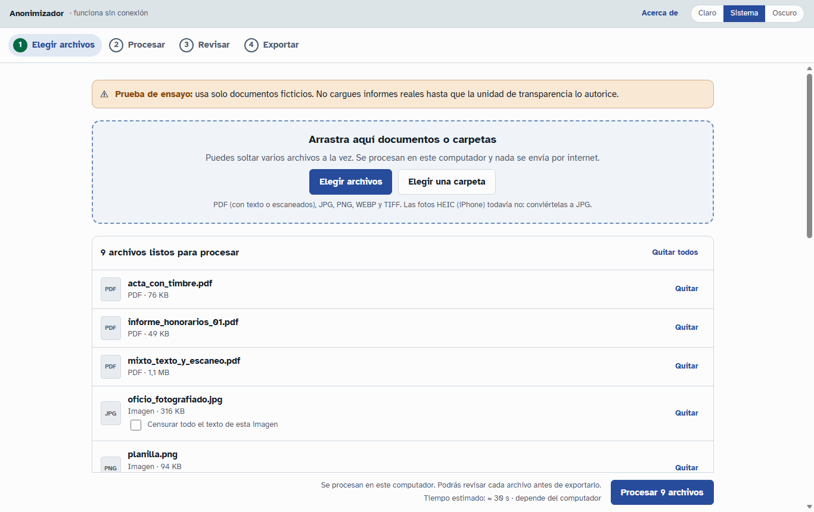
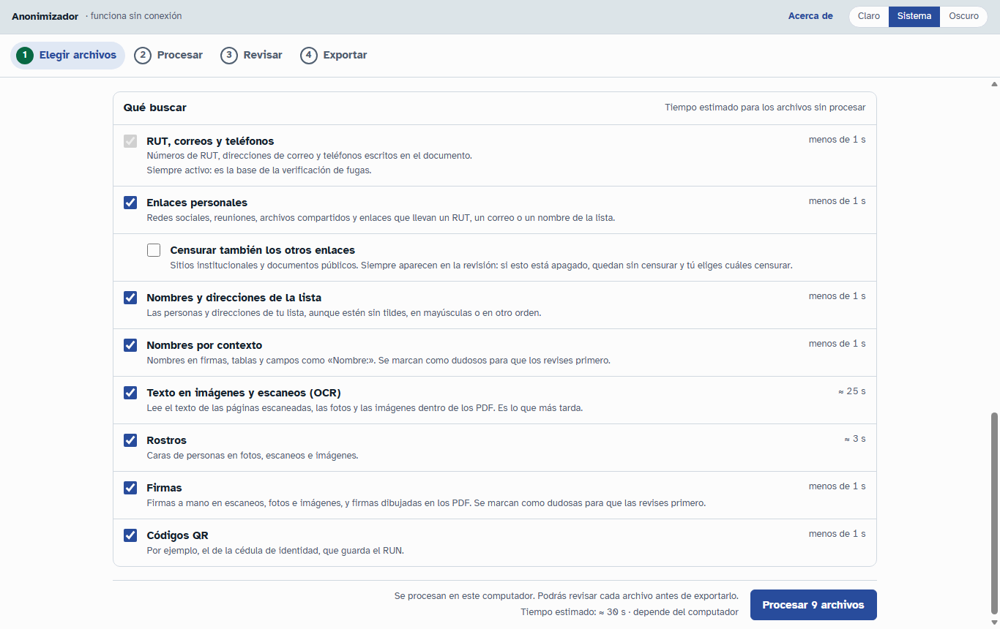
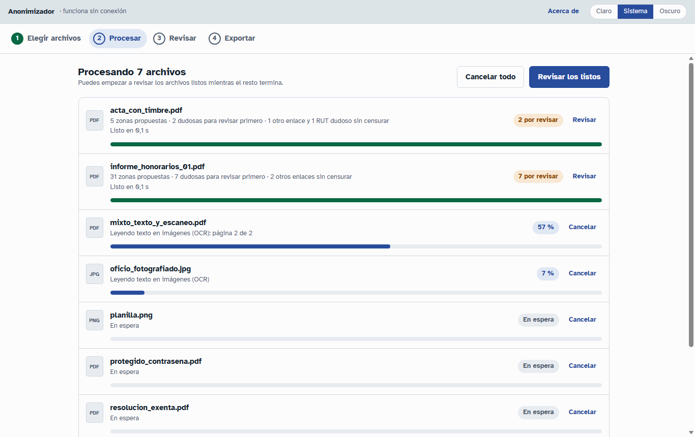
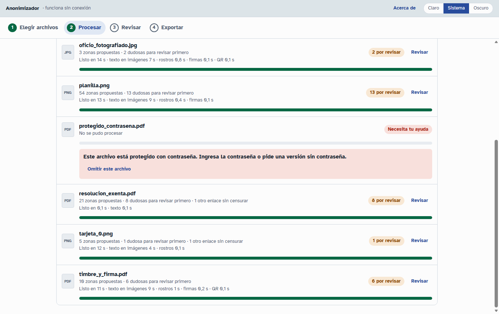
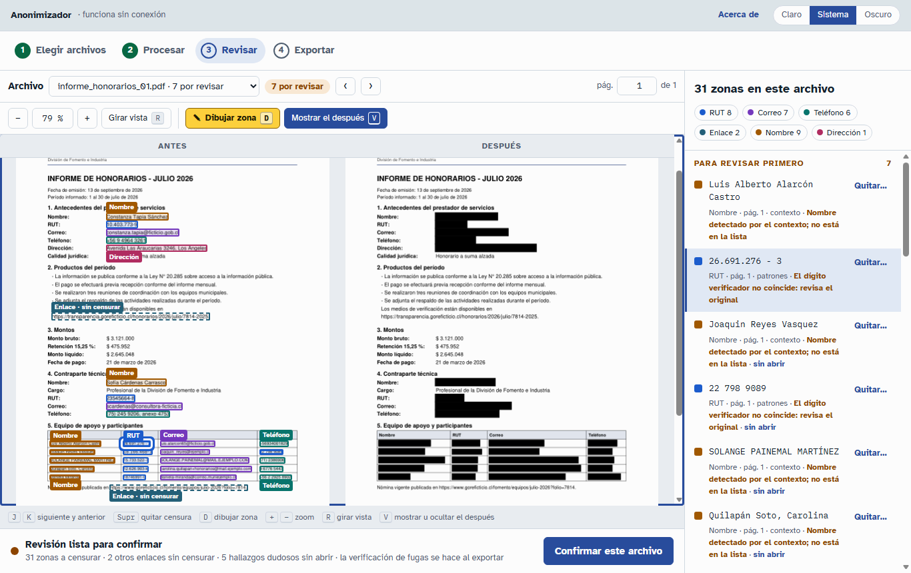
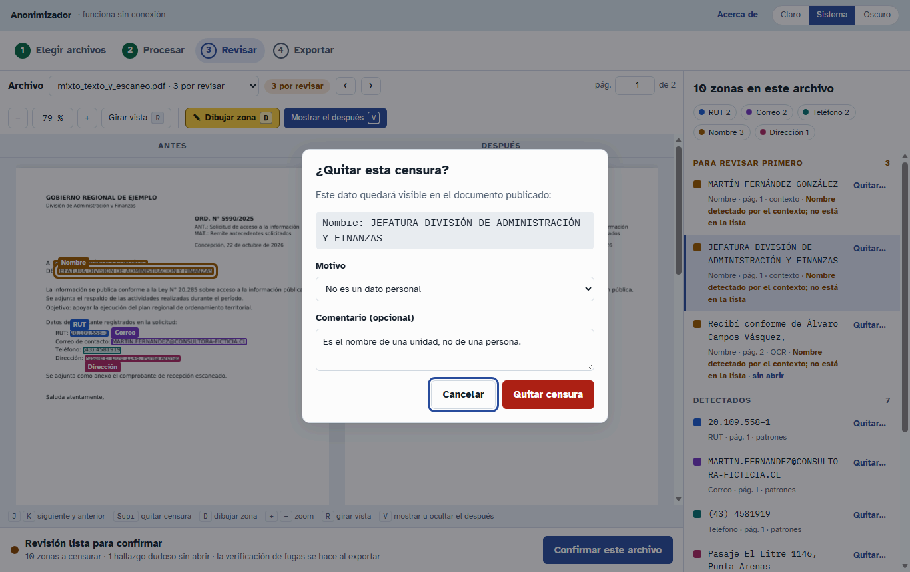
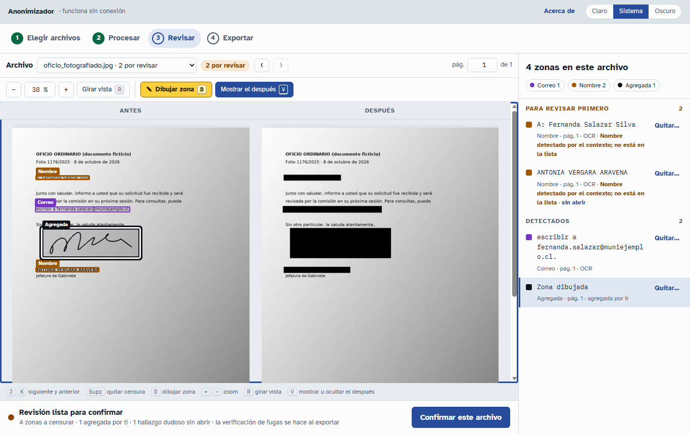
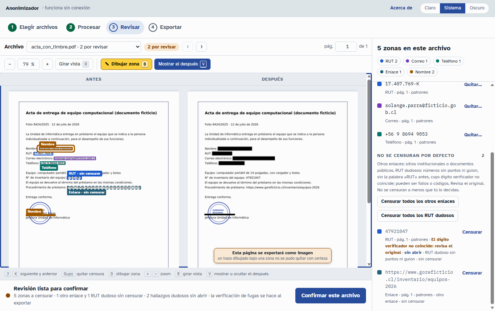
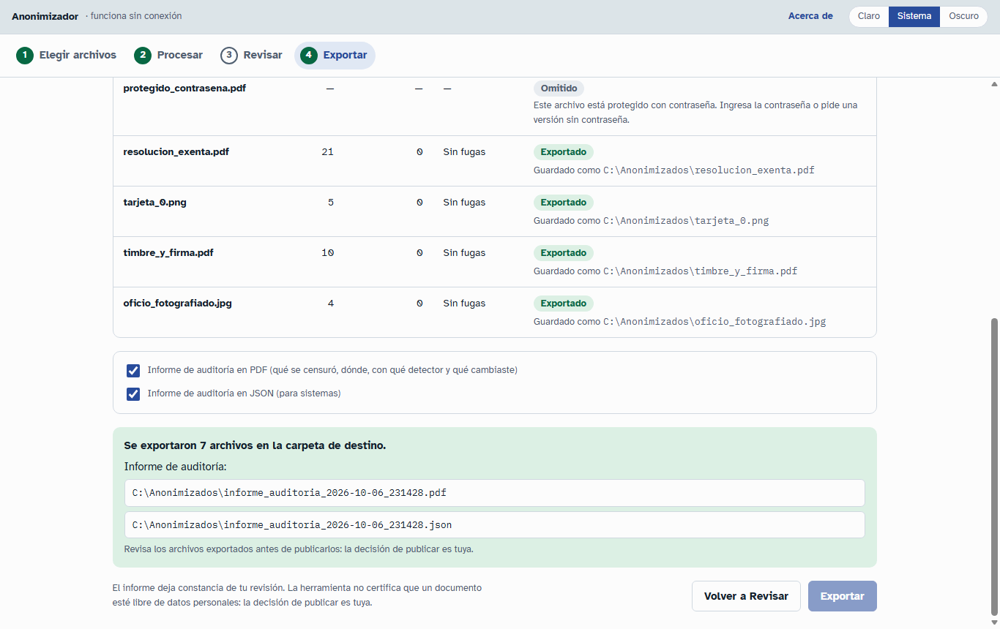
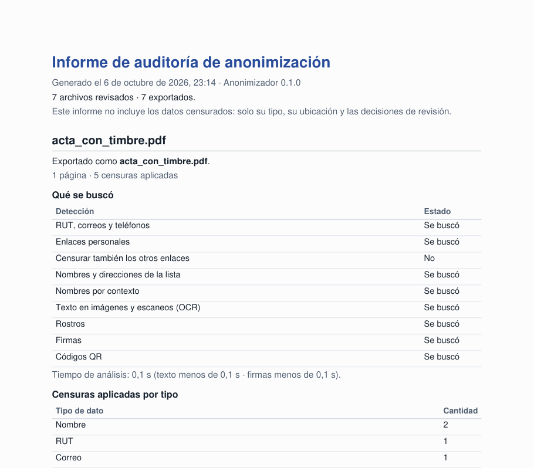

# Manual de usuario del Anonimizador

Versión 0.1 · octubre de 2026

Este manual es para las personas que publican documentos por transparencia en un gobierno regional. No necesitas saber de computación para usarlo. Las imágenes del manual muestran documentos inventados: ningún dato que aparece en ellas es de una persona real.

## Contenido

1. [Qué hace y qué no hace](#1-qué-hace-y-qué-no-hace)
2. [Instalar, actualizar y desinstalar](#2-instalar-actualizar-y-desinstalar)
3. [Cómo se trabaja: los cuatro pasos](#3-cómo-se-trabaja-los-cuatro-pasos)
4. [Paso 1: Elegir archivos](#4-paso-1-elegir-archivos)
5. [Qué buscar y cuánto se demora](#5-qué-buscar-y-cuánto-se-demora)
6. [La lista de nombres y la lista de excepciones](#6-la-lista-de-nombres-y-la-lista-de-excepciones)
7. [Paso 2: Procesar](#7-paso-2-procesar)
8. [Paso 3: Revisar](#8-paso-3-revisar)
9. [Paso 4: Exportar](#9-paso-4-exportar)
10. [El informe de auditoría](#10-el-informe-de-auditoría)
11. [Lo que la aplicación todavía no hace bien](#11-lo-que-la-aplicación-todavía-no-hace-bien)
12. [Privacidad: dónde quedan tus documentos](#12-privacidad-dónde-quedan-tus-documentos)
13. [Problemas comunes y preguntas frecuentes](#13-problemas-comunes-y-preguntas-frecuentes)

## 1. Qué hace y qué no hace

El Anonimizador busca datos personales en documentos PDF y en imágenes, y te ayuda a borrarlos antes de publicar. Funciona en tu computador, sin internet.

**Lo que hace:**

- Busca RUT, correos, teléfonos, enlaces personales, nombres y direcciones, rostros, firmas y códigos QR.
- También lee el texto que está dentro de imágenes: páginas escaneadas, fotos y pantallazos. A esto se le llama OCR, que significa "leer texto en imágenes".
- Te muestra cada documento antes y después de censurar, lado a lado, para que revises todo.
- Borra los datos de verdad. No pone un rectángulo negro encima con el dato todavía escondido debajo: el texto, la imagen o el dibujo que había bajo la zona censurada se elimina del archivo.
- Limpia los datos ocultos del archivo, por ejemplo el autor, la ubicación GPS de una foto, los comentarios y los archivos adjuntos.
- Revisa el resultado una vez más antes de guardarlo. Si encuentra un dato que sigue legible, no guarda ese archivo.
- Deja un informe de auditoría con lo que se censuró y lo que tú decidiste.

**Lo que no hace:**

- **No reemplaza tu revisión.** La aplicación se puede equivocar: puede no ver un dato o puede marcar algo que no es un dato personal. Revisar cada documento antes de publicarlo es obligatorio, siempre.
- **Nunca dice "documento limpio".** Cuando termina, dice "Revisión lista para confirmar". La decisión de publicar es tuya.
- No censura montos ni fechas.
- No cambia tus archivos originales. Siempre guarda una copia nueva.

> **Prueba de ensayo.** Mientras dure la marcha blanca, la pantalla de inicio muestra este aviso: "usa solo documentos ficticios. No cargues informes reales hasta que la unidad de transparencia lo autorice". Respeta ese aviso.

## 2. Instalar, actualizar y desinstalar

La aplicación funciona en Windows 10 y Windows 11 de 64 bits. No funciona en Mac.

### Instalar con el instalador

1. Abre el archivo `LightAnonymizer-<versión>-setup.exe` que te entregaron.
2. Windows puede mostrar el aviso **"Windows protegió su PC"**, con "Editor desconocido". Aparece porque el programa todavía no tiene firma digital. Si lo recibiste de una fuente confiable, haz clic en **"Más información"** y luego en **"Ejecutar de todas formas"**.
3. Sigue los pasos del instalador. Está en español y no pide permisos de administrador: se instala solo para tu usuario.
4. La página "Licencia" muestra la licencia del programa. No tienes que aceptarla para usarlo: haz clic en Siguiente.
5. Puedes elegir crear un acceso directo en el escritorio. Viene desmarcado.
6. Al final, deja marcada la casilla **"Abrir el Anonimizador"** si quieres empezar de inmediato.

Después, abre la aplicación desde el menú Inicio: se llama **Anonimizador**. La primera vez puede tardar un poco más, porque el antivirus la revisa.

Si tu equipo tiene el "Control inteligente de aplicaciones" o reglas de la institución, puede que Windows no te deje abrirla. En ese caso, pide ayuda a soporte informático.

### Instalar con el archivo .zip

A veces la aplicación se entrega como `LightAnonymizer-<versión>-windows.zip`.

1. Descomprime el .zip completo en una carpeta con una ruta corta y fuera de OneDrive, por ejemplo `C:\Anonimizador`. No abras el programa desde dentro del .zip.
2. Abre `LightAnonymizer.exe`. Deja la carpeta `_internal` junto al programa: es parte de él.

### Actualizar

Abre el instalador de la versión nueva. Se instala encima de la anterior y no toca tus datos. Antes de instalar, cierra el Anonimizador: el instalador te lo pedirá si está abierto.

### Desinstalar

1. Cierra el Anonimizador.
2. Abre **Configuración > Aplicaciones > Aplicaciones instaladas** (en Windows 10: Aplicaciones y características).
3. Busca **Anonimizador** y elige Desinstalar.
4. El desinstalador pregunta si quieres borrar también el registro técnico y las estimaciones de tiempo que la aplicación guardó. Esos archivos nunca contienen documentos. Si respondes No, se conservan para una próxima instalación.

Al desinstalar, siempre se borran las copias de trabajo de documentos que hayan quedado en la carpeta temporal de Windows.

### Al cerrar la aplicación

Si cierras la ventana con archivos en proceso, o revisados pero no exportados, la aplicación pregunta antes de cerrar: ese trabajo se pierde. La aplicación no guarda tu revisión para la próxima vez.

## 3. Cómo se trabaja: los cuatro pasos

Arriba de la ventana están los cuatro pasos. Puedes pasar de uno a otro cuando quieras.

1. **Elegir archivos:** agregas los documentos y decides qué buscar.
2. **Procesar:** la aplicación busca los datos personales.
3. **Revisar:** tú revisas cada documento y corriges lo que haga falta.
4. **Exportar:** la aplicación guarda las copias censuradas y el informe de auditoría.

Arriba a la derecha puedes elegir el tema de colores (Claro, Sistema u Oscuro) y abrir **Acerca de**, que muestra la versión, la licencia y dónde está el código fuente.

## 4. Paso 1: Elegir archivos

Para agregar documentos tienes tres caminos:

- Arrástralos a la zona "Arrastra aquí documentos o carpetas". Puedes soltar varios archivos o carpetas a la vez.
- Haz clic en **Elegir archivos**.
- Haz clic en **Elegir una carpeta**. Se agregan todos los documentos de esa carpeta, también los de sus subcarpetas.

La aplicación acepta PDF (con texto o escaneados), JPG, PNG, WEBP y TIFF. Las fotos HEIC de iPhone todavía no se pueden abrir: conviértelas a JPG y vuelve a agregarlas. Cada archivo puede pesar hasta 1 GB.

La aplicación hace una copia de cada documento para trabajar. Tu archivo original no cambia.

En la lista de archivos:

- **Quitar** saca un archivo de la lista. **Quitar todos** saca todos. Los originales no cambian.
- Las imágenes tienen la casilla **"Censurar todo el texto de esta imagen"**. Úsala cuando la imagen completa es información personal, por ejemplo una foto de una cédula o de una carta escrita a mano. Si cambias esta casilla después de procesar, vuelve a procesar ese archivo.

Cuando estés listo, haz clic en **Procesar** (el botón dice cuántos archivos procesará).

## 5. Qué buscar y cuánto se demora

Más abajo, en la misma pantalla, está el panel **Qué buscar**. Ahí eliges qué tipos de datos se buscan. Al lado de cada grupo aparece cuánto tiempo agrega, y abajo el tiempo total estimado.

| Grupo | Qué busca |
|---|---|
| RUT, correos y teléfonos | Siempre activo: es la base de la verificación final. No se puede apagar. |
| Enlaces personales | Redes sociales, reuniones, archivos compartidos y enlaces que llevan un RUT, un correo o un nombre de tu lista. |
| Censurar también los otros enlaces | Los otros enlaces (sitios institucionales, documentos públicos) siempre aparecen en la revisión. Con esta casilla apagada, quedan sin censurar y tú eliges cuáles censurar. Con ella marcada, empiezan censurados. |
| Nombres y direcciones de la lista | Las personas y direcciones de tu lista de nombres. |
| Nombres por contexto | Nombres en firmas, tablas y campos como "Nombre:". Se marcan como dudosos. |
| Texto en imágenes y escaneos (OCR) | Lee el texto de páginas escaneadas, fotos e imágenes dentro de los PDF. Es lo que más tarda. |
| Rostros | Caras de personas en fotos, escaneos e imágenes. |
| Firmas | Firmas a mano y firmas dibujadas en los PDF. Siempre se marcan como dudosas. |
| Códigos QR | Por ejemplo, el de la cédula de identidad, que guarda el RUN. |

**Recomendación: deja todo marcado.** Un grupo apagado no se busca en absoluto. Por ejemplo, si apagas el OCR, no se lee ningún dato dentro de las imágenes y los escaneos. Cuando algo quedó apagado, la revisión, la exportación y el informe de auditoría te lo recuerdan con el aviso "En este archivo no se buscaron: …". En ese caso, revisa esas partes a mano.

Lo que elijas vale solo mientras la aplicación esté abierta. Cada vez que la abres, todo vuelve a estar marcado.

**Cuánto se demora.** El tiempo estimado depende del computador y se ajusta solo con el tiempo real de los archivos que procesas. Como referencia:

- Una página de PDF con texto: menos de un segundo.
- Una página escaneada: unos 10 segundos, casi todo para leer el texto (OCR).
- Una foto: unos 2 segundos. Un pantallazo con mucho texto: unos 10 segundos.

## 6. La lista de nombres y la lista de excepciones

En la pantalla de inicio hay dos listas. Para cambiarlas, haz clic en **Editar lista**, escribe un dato por línea y haz clic en **Guardar lista**.

### Lista de nombres y direcciones

Escribe los nombres y direcciones que siempre deben censurarse: por ejemplo, las personas de un concurso o los prestadores de un informe de honorarios. Se censuran donde aparezcan, aunque estén sin tildes, en mayúsculas o en otro orden.

La lista es importante porque, **dentro de un párrafo, la aplicación solo reconoce los nombres que están en tu lista.** Fuera de los párrafos (en firmas, tablas, encabezados de correo o campos como "Nombre:") también encuentra nombres que no están en la lista, pero los marca como dudosos.

### Lista de excepciones

Escribe los RUT, teléfonos y números 600 u 800 que no quieres censurar: por ejemplo, el RUT de tu institución o su mesa central. Se aceptan con o sin puntos, guiones o espacios. Una línea que no es un RUT ni un teléfono se rechaza, y la ventana te dice cuál es.

Un valor de esta lista **igual se detecta**: aparece en la revisión, sin censurar, en el grupo "No se censuran por defecto". Tú decides si lo censuras. Si en la misma zona hay otro dato (un nombre, un correo u otro número), la zona se censura igual.

### Cosas que debes saber de las dos listas

- Se aplican a los archivos que proceses **después** de guardarlas. Si ya habías procesado un archivo, vuelve a procesarlo.
- Las listas se borran al cerrar la aplicación. Si las usas seguido, guárdalas en un archivo de texto y pégalas cada vez.
- La lista de nombres contiene datos personales. Guárdala en un lugar seguro, igual que los documentos originales.

## 7. Paso 2: Procesar

Aquí ves el avance de cada archivo. Puedes:

- Hacer clic en **Revisar los listos** o en **Revisar** junto a un archivo: no tienes que esperar a que terminen todos.
- **Cancelar** un archivo o **Cancelar todo**. Un archivo cancelado se puede volver a procesar con **Procesar**.

Cuando un archivo termina, muestra cuántas zonas propone censurar, cuántas son dudosas y cuánto se demoró.

### Un archivo que "Necesita tu ayuda"

Si un archivo no se pudo procesar, aparece en rojo con **Necesita tu ayuda** y un mensaje que explica por qué. Lo más común:

- **Protegido con contraseña:** pide una versión sin contraseña. La aplicación todavía no tiene dónde escribir la contraseña.
- **Dañado:** pide una copia nueva a quien lo envió.
- **Vacío** o **un tipo de archivo que no se puede procesar:** revisa que sea el archivo correcto.
- **Foto HEIC:** conviértela a JPG.
- **Ocurrió un problema al procesar este archivo:** haz clic en **Intentar de nuevo**.

Con **Omitir este archivo** lo sacas de la lista.

## 8. Paso 3: Revisar

Este es el paso más importante. Aquí decides qué se censura.

### Qué ves en la pantalla

- **Arriba:** el archivo que estás revisando. Cambia de archivo con la lista desplegable o con los botones ‹ y ›. El campo "pág." te lleva a una página.
- **Al centro, dos columnas:**
    - **Antes:** el documento original, con cada dato encontrado marcado con un recuadro de color.
    - **Después:** el documento tal como se va a exportar, con los rectángulos negros. Lo que ves aquí es lo que se publicará.
    - Todas las páginas están una debajo de otra. Baja con la rueda del mouse o con la barra.
- **A la derecha:** la lista de hallazgos, es decir, los datos que la aplicación encontró.
- **Abajo:** el resumen del archivo y el botón **Confirmar este archivo**.

Las herramientas sobre el documento son: **−** y **+** para alejar y acercar (el porcentaje ajusta la página al ancho), **Girar vista** (solo cambia cómo la ves; el archivo exportado conserva su orientación), **Dibujar zona** y **Mostrar el después**, que muestra u oculta la columna Después.

### Los colores de las zonas

Cada tipo de dato tiene su color y su etiqueta: RUT, Correo, Teléfono, Enlace, Nombre, Dirección, Rostro, Firma, Código QR, Texto en imagen y Agregada (las zonas que dibujas tú). Los botones de colores sobre la lista sirven de leyenda y de filtro: haz clic en uno para ocultar o mostrar ese tipo.

- Un recuadro **con borde grueso** es un hallazgo dudoso.
- Un recuadro **con borde punteado** no se va a censurar: es una sugerencia que no aplicaste ("sin censurar") o una censura que quitaste ("quitada").

### La lista de hallazgos

La lista tiene tres grupos:

1. **Para revisar primero:** los hallazgos dudosos. Revísalos siempre uno por uno. Cada uno dice por qué es dudoso, por ejemplo:
    - "Nombre detectado por el contexto; no está en la lista".
    - "El dígito verificador no coincide: revisa el original".
    - "Posible firma: revisa el original".
    - "Texto leído con baja confianza".
    - "Rostro pequeño o poco claro".

    Los que todavía no abriste dicen **sin abrir**.

2. **Detectados:** los datos encontrados con seguridad.
3. **No se censuran por defecto:** sugerencias que la aplicación muestra pero no censura (ver más abajo).

Cada hallazgo muestra el dato, su tipo, la página y cómo se encontró: patrones, lista de nombres, contexto, OCR (leído en una imagen), rostros, firmas, código QR o agregada por ti.

Haz clic en un hallazgo para ir a él en el documento. También puedes hacer clic en una zona del documento.

### Cómo revisar un archivo, paso a paso

1. Al abrir un archivo, el primer hallazgo dudoso ya está seleccionado y resaltado en el documento. Mira el dato en la columna Antes.
2. Si el dato es personal, déjalo como está. Si no lo es, quita la censura (ver abajo).
3. Presiona **J** para pasar al siguiente hallazgo. **K** vuelve al anterior. Si el teclado no responde, haz clic primero sobre el documento.
4. Baja por todas las páginas y mira la columna **Después**. Busca datos que se vean y que la aplicación no marcó. Si encuentras uno, dibuja una zona.
5. Mira el grupo "No se censuran por defecto" y decide qué censurar.
6. Haz clic en **Confirmar este archivo**.

Si quedan hallazgos dudosos sin abrir, la aplicación te avisa: "Te recomendamos revisarlos uno por uno (con J y K) antes de confirmar". Puedes volver a revisarlos o elegir **Confirmar igual**.

Después de confirmar, puedes pasar al **Siguiente archivo por revisar** o **Ir a Exportar**. Si cambias algo en un archivo confirmado, tendrás que confirmarlo otra vez.

### Quitar una censura

A veces la aplicación marca algo que no es un dato personal, por ejemplo el nombre de una unidad o una oficina.

1. En la lista, haz clic en **Quitar…** junto al hallazgo. También puedes seleccionarlo y presionar **Supr**.
2. La ventana "¿Quitar esta censura?" muestra el dato que quedará visible.
3. Elige un **Motivo**: "No es un dato personal", "Es un dato de un funcionario en su cargo", "La información ya es pública" u "Otro motivo".
4. Si quieres, escribe un **Comentario**. Queda en el informe de auditoría.
5. Haz clic en **Quitar censura**.

La censura quitada queda en la lista, tachada, con el botón **Restaurar** por si te arrepientes. El informe de auditoría registra cada censura que quitaste y su motivo.

### Dibujar una zona

Si ves un dato que la aplicación no marcó (una firma, un nombre escrito a mano, un timbre con datos), cúbrelo con una zona:

1. Haz clic en **Dibujar zona** o presiona **D**. El botón cambia a "Dibujando · Esc para salir".
2. En la columna **Antes**, arrastra el mouse sobre el dato para dibujar un rectángulo.
3. Al soltar, la zona queda agregada como "Zona dibujada" y la columna Después la muestra en negro.

Dibuja la zona justo sobre el dato. Si la zona toca letras de una línea vecina, esas letras también se borran. Para salir sin dibujar, presiona **Esc**.

Una zona dibujada se quita igual que cualquier censura, con **Quitar…**.

### "No se censuran por defecto"

Este grupo reúne datos que la aplicación encontró pero que **no censura a menos que tú lo decidas**. Aparecen con borde punteado y la etiqueta "sin censurar". Hay tres tipos:

- **Otros enlaces:** sitios institucionales o documentos públicos, como una noticia o una resolución publicada. Los enlaces personales (redes sociales, reuniones, archivos compartidos, enlaces con un RUT o un correo) sí se censuran siempre.
- **Excepciones:** los valores de tu lista de excepciones.
- **RUT dudosos sin puntos ni guion:** números escritos solo con dígitos, sin la palabra "RUT" antes, cuyo dígito verificador no coincide. Suelen ser folios, códigos o números de inventario. Pero también pueden ser un RUT mal escrito: **revisa el original**.

Para cada uno, usa **Censurar** o **No censurar**. No hace falta escribir un motivo. Los botones **Censurar todos los otros enlaces**, **Censurar todas las excepciones** y **Censurar todos los RUT dudosos** censuran todo el grupo de una vez. El informe de auditoría registra lo que decidiste.

Ojo: un RUT escrito con puntos o guion, o con la palabra "RUT" antes, se censura siempre, aunque su dígito verificador no coincida. En ese caso aparece entre los dudosos.

### "Esta página se exportará como imagen"

En algunas páginas de PDF, la columna Después muestra el aviso **"Esta página se exportará como imagen"**, con el motivo.

Pasa cuando bajo una zona censurada hay algo dibujado que la aplicación no puede borrar con total seguridad: por ejemplo, el anillo de un timbre que cruza un nombre, una letra dibujada que la zona corta por la mitad, o un fondo con trama. Para no arriesgar, la aplicación guarda esa página como una sola imagen de la página ya censurada. Así, lo que había bajo la zona desaparece de verdad.

Lo que cambia en esa página:

- Ya no se puede seleccionar, copiar ni buscar su texto, y los lectores de pantalla no la pueden leer.
- El archivo pesa más: unos 0,4 MB por una página de texto, de 1 a 2 MB si tiene fotos.
- Fuera de las zonas censuradas, la página se ve igual que antes.

No tienes que hacer nada: es una protección. Lo que ves en la columna Después es exactamente lo que se exportará. El informe de auditoría dice qué páginas se exportaron como imagen y por qué.

### Atajos de teclado

Los atajos funcionan en la pantalla Revisar, cuando no estás escribiendo en un campo.

| Tecla | Qué hace |
|---|---|
| J | Siguiente hallazgo (primero los dudosos) |
| K | Hallazgo anterior |
| Supr | Quitar la censura del hallazgo seleccionado |
| D | Dibujar zona (otra vez D para dejar de dibujar) |
| Esc | Salir del modo dibujo |
| + y − | Acercar y alejar |
| R | Girar la vista |
| V | Mostrar u ocultar la columna Después |
| RePág, AvPág, flechas, espacio | Moverse por las páginas |

## 9. Paso 4: Exportar

1. Revisa la **Carpeta de destino**. Por defecto es `Documentos\Anonimizados`. Para cambiarla, haz clic en **Cambiar carpeta** o escribe la ruta.
2. Revisa la tabla. Solo se exportan los archivos **confirmados**. Los demás dicen por qué no: "Falta confirmar la revisión", "Todavía se está procesando" u "Omitido".
3. Deja marcados los informes de auditoría en PDF y en JSON.
4. Haz clic en **Exportar** (el botón dice cuántos archivos).

**Nada se sobrescribe.** Cada archivo se guarda con su mismo nombre en la carpeta de destino. Si ya existe uno con ese nombre, se agrega un número, por ejemplo "informe (2).pdf". Los originales nunca se modifican.

### La verificación de fugas

Antes de guardar cada archivo, la aplicación lo revisa otra vez con los mismos detectores. Busca datos censurados que sigan legibles, datos que nadie marcó y datos ocultos del archivo. Si todo está bien, la columna Verificación dice **Sin fugas** y el estado dice **Exportado**, con el nombre del archivo guardado.

"Sin fugas" significa que la revisión automática no encontró nada. No es una garantía: igual revisa los archivos exportados antes de publicarlos.

### Si un archivo no se exporta

Si la verificación encuentra un dato que sigue legible, **ese archivo no se guarda**. La tabla dice "No se exporta" y el mensaje "No se exportó: la verificación encontró … datos que siguen legibles. Vuelve a Revisar". Los demás archivos se exportan igual.

Qué hacer:

1. Vuelve a **Revisar** y abre ese archivo. Arriba de la lista de hallazgos aparece un recuadro con las **fugas sin resolver** y en qué página está cada una.
2. Haz clic en **Ver** o **Ver página** para ir al lugar.
3. Cubre el dato: dibuja una zona encima o restaura una censura que hayas quitado.
4. Confirma el archivo otra vez y vuelve a exportar.

Si el mensaje dice que el archivo todavía tiene datos ocultos (metadatos o archivos adjuntos), o se repite sin que veas el problema, pide ayuda a soporte informático y no publiques ese archivo.

Si la carpeta de destino no se puede usar ("No se puede guardar en esa carpeta. Elige otra"), elige otra carpeta. Pasa con carpetas de solo lectura o protegidas por el antivirus.

## 10. El informe de auditoría

Al exportar se crean dos archivos en la misma carpeta de destino:

- `informe_auditoria_<fecha>_<hora>.pdf`: para leerlo y archivarlo.
- `informe_auditoria_<fecha>_<hora>.json`: el mismo contenido, para sistemas.

La ruta de los dos aparece al final de la pantalla Exportar, bajo "Informe de auditoría".

Para cada archivo, el informe dice:

- Con qué nombre se exportó, o por qué no se exportó.
- Qué se buscó y qué no.
- Cuántas censuras se aplicaron, por tipo, y cuántos hallazgos dudosos se mostraron.
- Las censuras que quitaste, con su motivo y tu comentario.
- Los otros enlaces, las excepciones y los RUT dudosos que censuraste o dejaste visibles.
- Las páginas exportadas como imagen y por qué.
- Las zonas que dibujaste.
- El resultado de la verificación de fugas.

El informe no incluye los datos censurados: solo su tipo, su ubicación y las decisiones de revisión. Sí muestra los datos que decidiste dejar visibles, porque esos se van a publicar.

El informe deja constancia de tu revisión. La herramienta no certifica que un documento esté libre de datos personales: la decisión de publicar es tuya.

## 11. Lo que la aplicación todavía no hace bien

Conocer estos límites te ayuda a revisar mejor.

- **Nombres dentro de párrafos:** solo se encuentran si están en tu lista de nombres. En firmas, tablas, encabezados de correo y campos como "Nombre:" también se encuentran por contexto, marcados como dudosos.
- **Montos y fechas:** no se censuran.
- **Letra manuscrita, texto muy pequeño o imágenes de baja calidad:** el OCR puede no leerlos. Revisa con cuidado las notas a mano y los escaneos borrosos.
- **Texto en espejo** (una foto tomada con la cámara frontal): solo se lee cuando nada más en esa imagen se puede leer.
- **Rostros de perfil, muy pequeños o tapados:** pueden no detectarse.
- **Firmas:** se buscan con reglas, no con inteligencia artificial, y todas se marcan como dudosas. Se pueden escapar cuando no hay nada que las delate: sin la palabra "Firma", "V°B°" o "p.p." cerca, sin una línea de firma, o en una foto con luz desigual o torcida. También se pueden escapar un nombre escrito con letra cursiva de computador y una firma que se repite en el mismo lugar de todas las páginas. Al revés, una nota a mano cerca de la palabra "Firma" se puede confundir con una firma, y un timbre sobre la firma puede agrandar la zona hasta tapar el nombre y el cargo de quien firma.
- **Páginas exportadas como imagen:** pierden su texto seleccionable y pesan más (ver la sección 8).
- **RUT sin puntos ni guion con dígito verificador que no coincide:** no se censuran por defecto. Tú decides.
- **Fotos HEIC de iPhone:** no se pueden abrir. Conviértelas a JPG.
- **Texto dibujado en planos o dibujos técnicos** (letras hechas con trazos, como en los planos de CAD): puede no encontrarse.
- **Páginas de tamaño especial** (algunos planos grandes): el rectángulo negro puede quedar más grande que la zona y tapar texto vecino.
- Cuando una zona toca una letra, esa letra se borra completa, aunque la zona la toque apenas. Por eso conviene dibujar las zonas justo sobre el dato.

**La revisión humana de cada documento antes de publicarlo es obligatoria.**

## 12. Privacidad: dónde quedan tus documentos

- **Nada sale del computador.** La aplicación funciona sin internet, no envía tus documentos ni tus datos a ningún lado y no tiene telemetría.
- **Copias de trabajo:** mientras trabajas, la aplicación guarda una copia de los documentos en la carpeta temporal de Windows. Las borra al cerrarse. Si se cierra de forma inesperada, las borra la próxima vez que la abras, o al desinstalarla.
- **Lo que queda guardado:** en `%LOCALAPPDATA%\Anonimizador` hay un registro técnico (para resolver problemas) y las estimaciones de tiempo. Nunca documentos.
- **Lo que tú guardas:** los archivos exportados y el informe de auditoría quedan en la carpeta de destino que elegiste. Trátalos con el mismo cuidado que los originales hasta publicarlos.
- **Windows:** la ventana de la aplicación usa un componente de Windows (WebView2). Windows puede actualizarlo o revisar el programa por su cuenta, como con cualquier otro programa. Tus documentos nunca viajan por esas conexiones. Si tu institución necesita cero conexiones, soporte informático puede bloquearlas en el firewall.

## 13. Problemas comunes y preguntas frecuentes

**Windows dice "Windows protegió su PC".**
El programa todavía no tiene firma digital. Si lo recibiste de una fuente confiable, haz clic en "Más información" y luego en "Ejecutar de todas formas". Si no aparece esa opción, pide ayuda a soporte informático.

**El antivirus bloqueó la aplicación, o aparece "Faltan componentes del motor de anonimización".**
El antivirus puede haber puesto en cuarentena una parte del programa. Instálalo de nuevo (o descomprime otra vez la carpeta completa del .zip). Si se repite, pide a soporte informático que agregue el Anonimizador como excepción del antivirus.

**La aplicación no abre desde el .zip, o falla al abrir.**
Las rutas muy largas pueden impedir que Windows cargue el programa. Descomprime la carpeta en una ruta corta y fuera de OneDrive, por ejemplo `C:\Anonimizador`. El instalador evita este problema.

**Aparece "El Anonimizador se cerró por un problema inesperado".**
El detalle quedó en el registro técnico (`%LOCALAPPDATA%\Anonimizador\logs`). Vuelve a abrir la aplicación. Si se repite, instálala de nuevo y avisa a soporte informático.

**Aparece "No se pudo conectar con el motor de la aplicación".**
Cierra el programa y vuelve a abrirlo.

**La aplicación está lenta con los escaneos.**
Es normal: leer el texto de una página escaneada toma unos 10 segundos. Mientras tanto, empieza a revisar los archivos que ya están listos con **Revisar los listos**. En un computador con poca memoria, procesa menos archivos a la vez. No apagues el OCR para ganar tiempo: sin OCR, no se busca ningún dato dentro de los escaneos.

**Un archivo dice "Necesita tu ayuda".**
Lee el mensaje rojo bajo el archivo, en la pantalla Procesar. Ver la sección 7.

**No puedo guardar en la carpeta Documentos.**
Algunos equipos protegen esa carpeta ("Acceso controlado a carpetas"). Elige otra carpeta de destino o pide ayuda a soporte informático.

**Cerré la aplicación y perdí mi revisión.**
La aplicación no guarda el trabajo entre sesiones. Exporta los archivos revisados antes de cerrar.

**Mi lista de nombres desapareció.**
Las listas se borran al cerrar la aplicación. Guárdalas en un archivo de texto en un lugar seguro y pégalas cada vez.

**¿Puedo confiar en "Sin fugas"?**
Significa que la verificación automática no encontró datos legibles. No reemplaza tu revisión: mira siempre la columna Después y los archivos exportados antes de publicarlos.

**¿Qué hago si encuentro un dato personal en un archivo ya publicado?**
Avisa de inmediato a la unidad de transparencia, según el procedimiento de tu institución.
